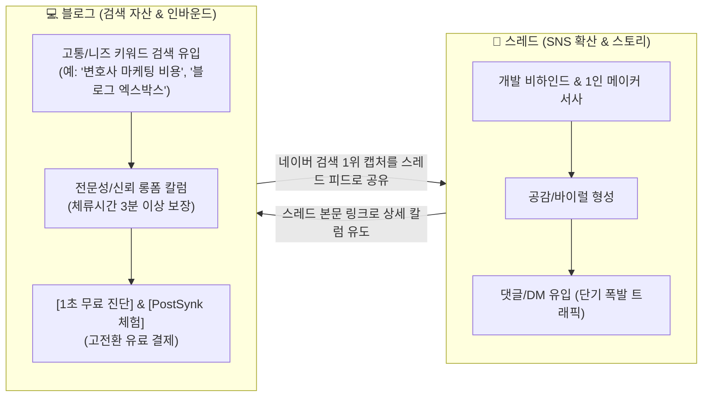
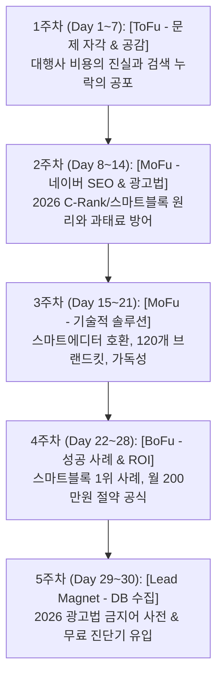

# 💻 PostSynk 30일 블로그 인바운드 SEO 마케팅 마스터 플랜

> **문서 목적:** 네이버/구글 검색창에 키워드를 직접 검색하는 고의도(High-Intent) 잠재 고객(변호사, 세무사, 노무사, 병의원 원장, 1인 사업가 등)을 지속적으로 유입시켜, 무료 진단 및 PostSynk 유료 결제로 전환시키는 30일 자산형(Evergreen) 인바운드 포스팅 로드맵.  
> **타깃 독자:**
> 1. 마케팅 대행사의 월 100~200만 원 비용 대비 효과 없는 복붙 글에 지친 전문직 및 소상공인 대표님
> 2. 광고법(변호사법 23조, 세무사법, 의료법 등) 과태료와 협회 징계가 두려운 개업 대표님
> 3. 본업(진료/상담/재판)으로 바빠 블로그 글쓰기 시간을 단축하고 상위 노출을 원하는 전문직

---

## 🌐 스레드 vs 블로그 인바운드 시너지 (OSMU 퍼널)



---

## 📑 30일 인바운드 로드맵 한눈에 보기



---

## 🗓️ [1주차] 문제 자각: "대행사에 매달 200만 원씩 쏟아붓는데 왜 문의가 없을까?"
> **테마:** '전문직 마케팅 대행'에 불만을 품은 대표님들의 검색 키워드를 장악하고 격한 공감 형성

| 일차 | 메인 타깃 키워드 | 추천 블로그 포스팅 제목 | 본문 핵심 스토리 및 구성 | 전환 CTA 장치 |
| :--- | :--- | :--- | :--- | :--- |
| **Day 1** | 전문직 블로그 마케팅 | **개업 세무사 변호사 마케팅 대행사 맡겼다가 후회하는 3가지 이유** | 복붙 원고 실태 폭로, 전문성 결여로 인한 전환율 0% 문제 분석. | 자가 진단 링크 |
| **Day 2** | 네이버 블로그 유사문서 | **전문직 블로그 글 누락 확인법: 대행사 복붙 원고 유사문서 해결 3단계** | 대행사 복붙 글로 인한 '유사문서 판정' 및 스마트블록 제외 원리. | 누락 진단 툴 안내 |
| **Day 3** | 변호사 세무사 광고법 위반 | **변호사법 23조 광고 규정 위반 과태료 피하는 안전한 블로그 단어** | 변호사법 제23조, 세무사법, 의료법 위반 실제 징계 사례와 위험성. | 광고법 가이드 신청 |
| **Day 4** | ChatGPT 블로그 글쓰기 한계 | **법률 세무 칼럼 ChatGPT 작성 시 가짜 판례 협회 징계 피하는 법** | 일반 AI의 환각(Hallucination) 현상과 전문직 글에 치명적인 이유. | RAG 기술 소개 |
| **Day 5** | 병원 마케팅 대행사 | **병원 의원 마케팅 대행사 보고서 허수 조회수 구별법 (체류시간 분석)** | 단순 조회수(체류시간 5초) vs 실제 전화 문의로 이어지는 글의 차이. | 칼럼 구독 유도 |
| **Day 6** | 1인 기업 블로그 운영 | **개업 세무사 변호사 블로그 글쓰기 3시간 걸리는 이유와 해결책** | 진료/상담하느라 바쁜 대표님들이 겪는 블로그 운영의 현실적 한계. | 생산성 팁 공유 |
| **Day 7** | 블로그 인바운드 마케팅 | **전문직 인바운드 마케팅: 가격 흥정 없는 고단가 수임 고객 유치법** | 아웃바운드(광고) vs 인바운드(신뢰형 칼럼) 고객의 객단가/전환율 비교. | 1주차 요약 뉴스레터 |

---

## 🗓️ [2주차] 알고리즘 & 전문성: "네이버 로봇과 협회 기준을 동시에 만족시키는 법"
> **테마:** 2026년 최신 네이버 알고리즘 및 광고법 준수 가이드를 통해 전문가로서의 독보적 신뢰 확보

| 일차 | 메인 타깃 키워드 | 추천 블로그 포스팅 제목 | 본문 핵심 스토리 및 구성 | 전환 CTA 장치 |
| :--- | :--- | :--- | :--- | :--- |
| **Day 8** | 2026 네이버 블로그 상위노출 | **전문직 네이버 스마트블록 상위노출 알고리즘: 인용되는 글의 3가지 법칙** | 네이버 검색엔진이 가산점을 주는 '1인칭 경험담 + 공공 출처' 구조. | 상위노출 체크리스트 |
| **Day 9** | 스마트블록 상위노출 조건 | **세무사 변호사 스마트블록 1위 블로그 목차 구조와 체류시간 비결** | 반응형 제목 어절 구조, 체류시간 3분 이상 유도하는 목차 구성법. | 목차 템플릿 배포 |
| **Day 10** | 세무사 블로그 광고 가이드 | **세무사법 위반 마케팅 금지 단어 10선과 합법 대체 표현 총정리** | '최대 절세', '국세청 출신 100%' 등 금지어 및 안전한 문장 템플릿. | 금지어 사전 다운로드 |
| **Day 11** | 변호사 마케팅 규정 | **변호사 광고 규정 위반 없는 승소 사례 작성법 (과태료 징계 예방)** | 법제처/대법원 판례 인용 방식과 사실 기반 승소 사례 작성 요령. | 법률 칼럼 서식 안내 |
| **Day 12** | 블로그 체류시간 늘리기 | **전문직 블로그 체류시간 늘리는 매거진 서식과 가독성 레이아웃 팁** | 인디고 포인트 바, 핵심 인용구 박스, 가독성 높은 폰트 줄간격 세팅. | 서식 CSS 팁 배포 |
| **Day 13** | AI 검색 SEO RAG | **변호사 세무사 AI 글쓰기 실시간 법령 판례 팩트체크 필수인 이유** | 실시간 국세청/대법원 데이터를 AI가 스스로 검색하여 글을 쓰는 원리. | RAG 팩트체크 시연 |
| **Day 14** | 네이버 이미지 유사문서 | **네이버 블로그 카드뉴스 이미지 유사문서 누락 피하는 고유 디자인 팁** | 네이버 봇의 이미지 메타데이터/형태소 분석과 고유 디자인의 필요성. | 브랜드킷 소개 |

---

## 🗓️ [3주차] 기술적 해법: "스마트에디터 ONE 호환과 120개 브랜드킷의 탄생"
> **테마:** PostSynk의 독보적인 기술(엑스박스 0건, 줄바꿈 알고리즘, 브랜드킷)을 자연스러운 솔루션으로 제시

| 일차 | 메인 타깃 키워드 | 추천 블로그 포스팅 제목 | 본문 핵심 스토리 및 구성 | 전환 CTA 장치 |
| :--- | :--- | :--- | :--- | :--- |
| **Day 15** | 네이버 블로그 이미지 오류 | **네이버 스마트에디터 사진 복사 시 엑스박스(❌) 오류 1초 해결법** | 네이버 외부 이미지 보안 정책과 고화질 PNG 렌더링 파이프라인 원리. | 원클릭 복사 체험 링크 |
| **Day 16** | 카드뉴스 제작 툴 | **전문직 블로그 카드뉴스 만들기: 포토샵 없이 1080px 고화질 제작법** | 번거로운 그래픽 툴 없이 글 내용에 맞춰 자동 생성되는 인포그래픽 9종. | 카드뉴스 예시 갤러리 |
| **Day 17** | 블로그 썸네일 줄바꿈 | **네이버 모바일 블로그 썸네일 글자 잘림 방지 어절 줄바꿈 팁** | 가독성을 망치는 글자 잘림 현상을 수학적으로 해결한 줄바꿈 알고리즘. | 썸네일 Before/After |
| **Day 18** | 브랜드 아이덴티티 디자인 | **전문직 블로그 브랜딩: 법률 세무 병원 신뢰도 높이는 고유 컬러 조합** | 10가지 프리미엄 컬러 × 4종 썸네일로 완성하는 독창적인 전문직 브랜딩. | 내 브랜드 컬러 찾기 |
| **Day 19** | 모바일 블로그 최적화 | **네이버 모바일 앱 썸네일 비율 1:1 잘림 없는 안전 영역 제작 가이드** | 스마트폰 검색 뷰 크롭 비율(1:1, 4:3)에 맞춘 안전 영역 설계 가이드. | 모바일 최적화 가이드 |
| **Day 20** | 블로그 포스팅 시간 단축 | **개업 전문직 블로그 포스팅 시간 2시간에서 30분으로 줄이는 법** | [키워드 입력 ➔ 팩트 검색 ➔ 이미지 6장 자동 생성 ➔ 네이버 1초 복사] 시연. | 30초 작성 영상 확인 |
| **Day 21** | 무료 블로그 진단기 | **네이버 블로그 상위노출 지수 확인: 광고법 위반 및 C-Rank 무료 진단** | `/seo-check` 기능을 통해 광고법 위반 단어 및 C-Rank 점수 진단 유도. | 1초 진단기 바로가기 |

---

## 🗓️ [4주차] 실전 증명 & ROI: "스마트블록 1위 등극과 월 200만 원 절약"
> **테마:** 실제 성공 사례, 타사/대행사 대비 압도적인 비용 절감(ROI) 데이터를 통한 결제 전환

| 일차 | 메인 타깃 키워드 | 추천 블로그 포스팅 제목 | 본문 핵심 스토리 및 구성 | 전환 CTA 장치 |
| :--- | :--- | :--- | :--- | :--- |
| **Day 22** | 전문직 마케팅 성공사례 | **개업 3개월 차 세무사 블로그 마케팅: 지역 키워드로 수임 문의 5배 만든 후기** | PostSynk로 주 3회 전문 칼럼 발행 후 지역 키워드 장악한 스토리. | 베타 유저 성공 인터뷰 |
| **Day 23** | 스마트블록 1위 노출 후기 | **상속세 전문 세무사 네이버 스마트블록 1위 노출 실제 분석 사례** | 실제 검색 결과 캡처와 글 구조, 체류시간 분석 데이터 공개. | 1위 노출 전략 분석집 |
| **Day 24** | 마케팅 대행사 비용 비교 | **전문직 마케팅 대행사 비용 월 200만 원 vs 자체 솔루션 1년 가성비 비교** | 연간 2,280만 원 절약 효과와 직접 통제 가능한 마케팅 자산의 가치. | 비용 절감 계산기 |
| **Day 25** | 변호사 마케팅 솔루션 | **로펌 소속 변호사 블로그 원고 작성 업무 부담 줄이고 야근 없앤 비결** | 글쓰기 부담을 덜고 본업인 사건 수임 및 변론에 집중하게 된 후기. | 로펌 무료 체험 문의 |
| **Day 26** | 노무사 블로그 운영 | **노무사 행정사 블로그 외주 대행 끊고 직접 자체 발행으로 바꾼 이유** | 퀄리티 통제 불가능한 외주의 한계를 극복하고 원클릭 자체 발행 체제 구축. | 자체 발행 가이드북 |
| **Day 27** | PostSynk 사용법 가이드 | **네이버 스마트에디터 ONE 서식 깨짐 없이 원클릭 복사 붙여넣기 꿀팁** | 실제 서비스 화면 캡처와 함께 단계별 사용법 및 복사/붙여넣기 가이드. | 무료 체험 가입 링크 |
| **Day 28** | 전문직 브랜딩 전략 | **전문직 칼럼 마케팅: 단순 홍보글 대신 수임으로 연결되는 글의 조건** | 양산형 키워드 도배를 버리고 진짜 잠재 의뢰인을 감동시키는 브랜딩. | 브랜딩 체크리스트 |

---

## 🗓️ [5주차] 리드 마그넷: "고급 자료집 배포로 폭발적인 가입 및 문의 DB 수집"
> **테마:** 검색 유입자를 회원가입, 뉴스레터, 무료 진단으로 전환시키는 킬러 리드 마그넷 배포

| 일차 | 메인 타깃 키워드 | 추천 블로그 포스팅 제목 | 본문 핵심 스토리 및 구성 | 전환 CTA 장치 |
| :--- | :--- | :--- | :--- | :--- |
| **Day 29** | 전문직 광고법 가이드북 | **[2026 무료 배포] 전문직 광고법 위반 금지어 사전 & 스마트블록 체크리스트 PDF** | 500개 판례 분석 금지어 사전 무료 다운로드 ➔ **이메일/가입 CTA** | PDF 즉시 다운로드 |
| **Day 30** | 블로그 마케팅 자동화 | **2026 전문직 블로그 마케팅 자동화 솔루션 PostSynk 정식 런칭 안내** | 시간과 비용을 아끼고 신뢰를 지켜주는 든든한 AI 파트너 선언 및 특별 혜택. | 런칭 특가 구독 링크 |

---

# ✍️ 주요 일자별 실전 블로그 포스팅 본문 템플릿

### 📝 [Day 1] 대행사 실태 폭로 포스팅 템플릿
```markdown
# 개업 세무사 변호사 마케팅 대행사 맡겼다가 후회하는 3가지 이유

"매달 마케팅 대행사에 200만 원씩 입금하고 있는데, 왜 실제 상담 문의 전화는 한 통도 안 올까요?"

개업 2년 차 세무사 대표님이 깊은 한숨을 쉬며 털어놓으신 고민입니다.
실제로 대행사가 올려놓은 블로그 글을 열어보고 저희는 경악을 금치 못했습니다.

---

## 1. 20대 아르바이트생이 복사해 붙여넣은 엉터리 원고
대행사는 전문직의 깊이 있는 법률/세무 지식을 알지 못합니다.
인터넷에 떠도는 글을 짜깁기하거나, ChatGPT에 "상속세 글 써줘"라고 대충 입력해 복사한 글이 대부분입니다.

- **결과:** 네이버 검색엔진이 '유사문서'로 판정하여 검색에서 영구 제외
- **문제점:** '무조건 절세 가능', '100% 승소' 같은 위험한 문구로 협회 과태료 위험 노출

---

## 2. 검색해서 들어온 고객이 3초 만에 이탈하는 이유
잠재 의뢰인은 바보가 아닙니다.
진짜 전문가가 직접 쓴 칼럼인지, 마케팅 대행사가 양산한 광고글인지 단 3초 만에 알아챕니다.
전환율이 0%인 이유는 '조회수'가 부족해서가 아니라 '전문성의 신뢰도'가 없기 때문입니다.

---

> 💡 **내 블로그 글, 혹시 광고법 위반이나 저품질 위험이 있을까요?**  
> 지금 운영 중인 블로그 글을 입력하시면 1초 만에 안전 점수를 진단해 드립니다.  
> 👉 [PostSynk 1초 무료 진단기 바로가기 (클릭)]
```

---

### 📝 [Day 15] 네이버 스마트에디터 엑스박스 오류 해결 포스팅 템플릿
```markdown
# 네이버 스마트에디터 사진 복사 시 엑스박스(❌) 오류 1초 해결법

AI 툴이나 웹페이지에서 작성한 예쁜 카드뉴스와 글을 복사(Ctrl+C)해서
네이버 블로그 스마트에디터 ONE에 붙여넣기(Ctrl+V)했더니...
이미지가 전부 깨지고 검은 엑스박스(❌)로 변해버려 당황하신 적 있으신가요?

---

## ❌ 왜 이런 오류가 발생할까요?
네이버 스마트에디터는 외부 웹 서버에 저장된 이미지 링크(Hotlinking)를 보안상 차단합니다.
따라서 외부 URL 이미지는 복사해 와도 네이버 서버에 정상 업로드되지 않고 깨지게 됩니다.

## 🛠️ 해결책: 0.05초 만에 고화질 PNG로 굽는 서버리스 엔진
이 문제를 해결하기 위해 PostSynk는 클라이언트 캔버스 변환 방식 대신,
서버리스 엣지 인프라(`@vercel/og`)를 통해 1080px 고화질 PNG 바이너리를 즉시 생성합니다.

1. **원클릭 복사 버튼 클릭**
2. **네이버 스마트에디터에 Ctrl + V**
3. **엑스박스 0건, 6장의 고화질 사진이 네이버 서버에 100% 정상 등록!**

---

> 🚀 **직접 테스트해 보세요!**  
> 2시간 걸리던 카드뉴스 제작과 포스팅, 이제 30초 만에 완벽 서식으로 끝내세요.  
> 👉 [PostSynk 무료 체험 시작하기]
```

---

# 💡 블로그 인바운드 전환율(CVR)을 10배 높이는 3대 공식

### 1. 포스팅 하단 고정형 CTA 인바운드 배너 (In-Post Funnel)
모든 포스팅 하단에 단순히 "문의하세요"가 아닌, **즉시 행동할 수 있는 매력적인 자석(Lead Magnet)**을 배치합니다.
```html
<div style="border: 2px solid #2563eb; border-radius: 12px; padding: 24px; background: #f8fafc; text-align: center;">
  <h3 style="color: #1e293b; margin-bottom: 8px;">🔍 내 블로그 글, 혹시 광고법 위반이나 저품질 위험이 있을까요?</h3>
  <p style="color: #64748b; margin-bottom: 16px;">AI 팩트체크 엔진으로 1초 만에 무료 자가진단을 받아보세요.</p>
  <a href="https://postsynk.com/seo-check" style="background: #2563eb; color: #ffffff; padding: 12px 24px; border-radius: 8px; font-weight: bold; text-decoration: none;">👉 1초 무료 진단받기 (회원가입 없음)</a>
</div>
```

### 2. 체류시간 3분 이상을 보장하는 C-Rank 본문 레이아웃
- **상단 3초 훅:** 독자의 고통 공감 질문 (2줄) + 핵심 결론 한눈에 보기
- **중간 비주얼 장치:** 300자마다 고화질 1080px 인포그래픽 카드뉴스 1장 배치 (스크롤 브레이커)
- **하단 공공 출처 명시:** 대법원 판례, 국세청 고시, 법제처 법령 링크 표기로 DIA+ 검색 신뢰도 만점 획득

### 3. 스레드와 블로그의 상호 링크 루프
- **스레드:** 300자 짧은 인사이트 + 개발 스토리 ➔ "더 자세한 가이드와 템플릿은 블로그 칼럼에 정리해 두었습니다 (링크)"
- **블로그:** 전문 칼럼 ➔ "개발 여정과 실시간 Q&A는 스레드(@postsynk)에서 소통하고 있습니다"
