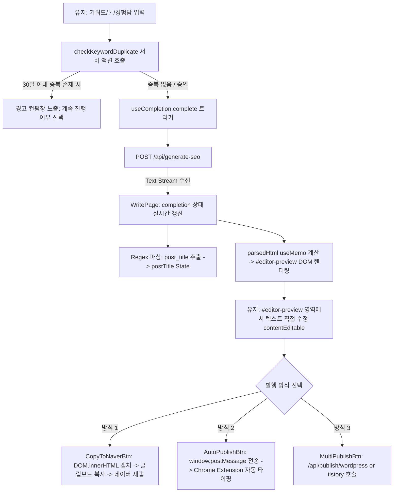
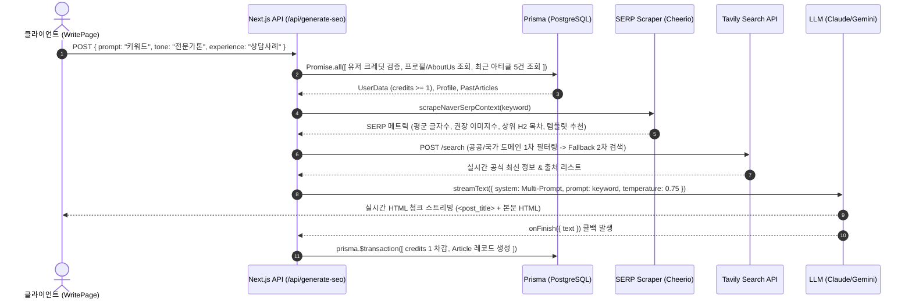
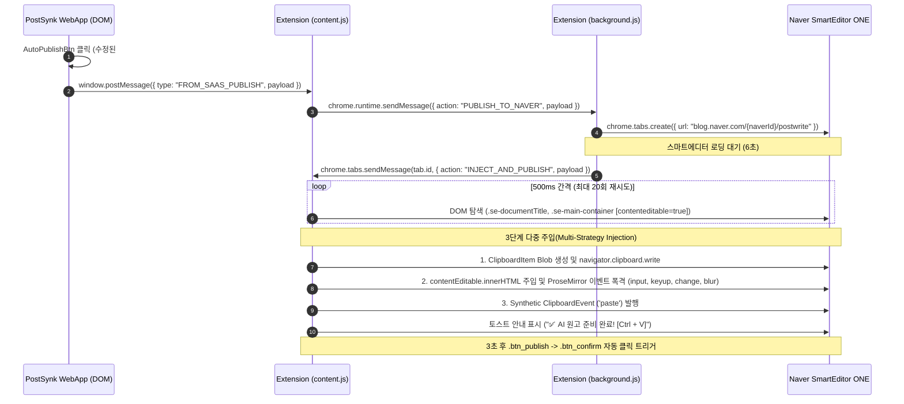
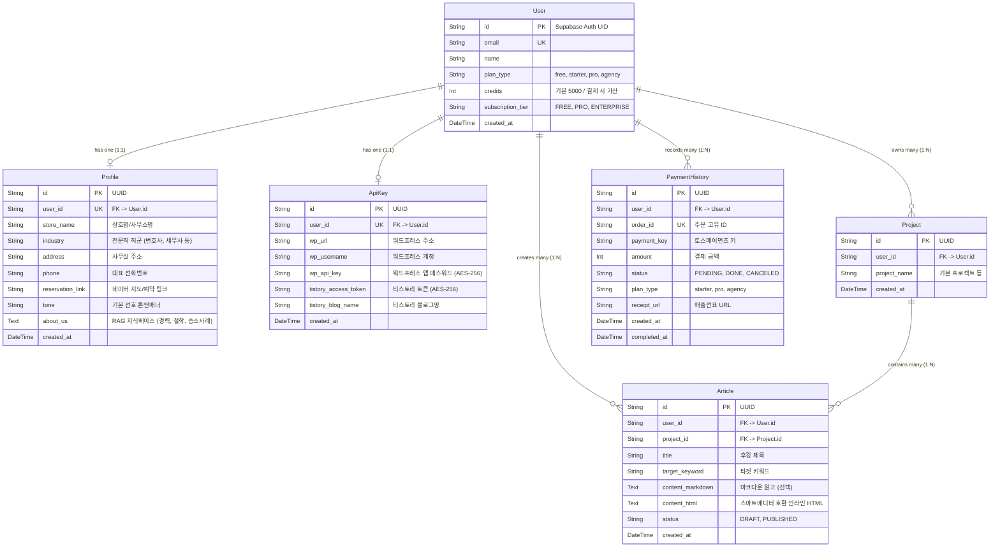
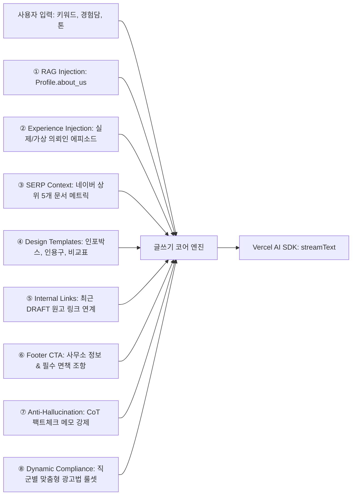
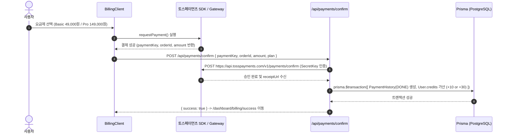

# 🏛️ PostSynk 시스템 통합 상세 아키텍처 (DETAILED_ARCHITECTURE.md)

> **시스템 명칭:** PostSynk (전문직 특화 네이버 블로그 SEO 원고 생성 및 원클릭 RPA 자동 발행 SaaS)  
> **기준 연도:** 2026년 최신 웹 표준 (Next.js 16 Turbopack, Vercel AI SDK, Supabase SSR, Chrome Extension MV3)  
> **문서 목적:** 관리자가 향후 유지보수 및 기능 추가 시 특정 구역을 즉시 식별하고 지시할 수 있는 **[ZONE-ID] 기반 모듈형 아키텍처 제어 청사진**

---

## 📑 목차 및 ZONE 맵핑 가이드

| 고유 ID | 아키텍처 분석 영역 | 핵심 담당 기능 |
| :--- | :--- | :--- |
| **[ZONE-1]** | **디렉토리 트리 (Directory Tree)** | 핵심 폴더 구조 및 파일별 비즈니스 로직 맵핑 |
| **[ZONE-2]** | **프론트엔드 UI 및 상태 흐름 (Frontend UI & State Flow)** | RSC/RCC 경계 분리 및 에디터/미리보기 상태 동기화 |
| **[ZONE-3]** | **백엔드 및 AI 파이프라인 (Backend & AI Flow)** | Next.js 내부 라우트 파이프라인 및 JSON 입출력 스키마 |
| **[ZONE-4]** | **클라이언트 스마트 복사 (Smart Clipboard & Direct Open)** | 스마트에디터 호환 서식 복사 및 네이버 글쓰기 새탭 연동 (확장프로그램 RPA 폐기 완료) |
| **[ZONE-5]** | **데이터베이스 (Database Schema & Relations)** | Prisma PostgreSQL 모델 정의, 관계도(ERD) 및 매핑 |
| **[ZONE-6]** | **글쓰기 코어 엔진 (Writing Engine & Prompts)** | C-Rank/DIA+ 대응 CoT 프롬프트, 인젝션 모듈, AI 파라미터 |
| **[ZONE-7]** | **Vercel 배포 및 인프라 (Deployment & Infra)** | Serverless 실행 시간(`maxDuration`), 스트리밍, 커넥션 풀링 |
| **[ZONE-8]** | **회원가입 및 권한 관리 (Auth & Security)** | Supabase SSR 세션 미들웨어, AES-256-CBC 암호화 보안 |
| **[ZONE-9]** | **결제 및 과금 (Billing & Monetization)** | 토스페이먼츠/포트원 연동, 티어 체계, 크레딧 트랜잭션 |
| **[ZONE-10]** | **외부 API 및 검색 (3rd-Party & Search)** | Tavily 실시간 검색 RAG, Unsplash 이미지, 채널톡 CS |
| **[ZONE-11]** | **멀티 플랫폼 자동 발행 (Multi-Platform Publishing)** | 워드프레스 REST API 및 티스토리 OpenAPI 동시 발행 |
| **[ZONE-12]** | **[폐기 완료] 스마트 큐레이션 및 클러스터링 (Deprecated)** | 토픽 클러스터링 및 큐레이션 모듈 완전 삭제 완료 |
| **[ZONE-13]** | **시스템 정화 이력 및 확장 슬롯 (System Deprecation & Extension)** | 폐기된 제휴마케팅, 확장프로그램 RPA, 클러스터링 내역 및 확장 슬롯 |
| **[ZONE-14]** | **관리자 조종 및 유지보수 플레이북 (Admin Playbook)** | 구역별 명령어 가이드 및 장애 대응 체크리스트 |

---

## ## [ZONE-1] 디렉토리 트리 (Directory Tree)

프로젝트 루트를 기준으로 한 핵심 소스코드 구조 및 파일별 비즈니스 로직 요약입니다.

```
naver_SaaS_Copy_For_USB/
├── prisma/
│   └── schema.prisma                # [ZONE-5] PostgreSQL 데이터베이스 스키마 정의 (Prisma ORM)
├── public/                          # 정적 에셋 (SVG 아이콘 및 정적 리소스)
├── src/
│   ├── actions/                     # Next.js Server Actions (서버 사이드 직접 실행 로직)
│   │   ├── articles.ts              # [ZONE-8] 최근 30일 중복 키워드 방지 검증 로직
│   │   ├── curation.ts              # [ZONE-12] 필러 키워드 기반 세부 클러스터 10종 생성 (generateObject)
│   │   ├── profile.ts               # [ZONE-8] 전문가 프로필 및 페르소나 지식베이스 CRUD
│   │   └── settings.ts              # [ZONE-8] 워드프레스/티스토리 API 키 AES-256 암호화 저장
│   ├── app/                         # Next.js App Router 기반 라우트 및 페이지
│   │   ├── api/                     # 백엔드 Route Handlers
│   │   │   ├── generate-clusters/   # [ZONE-12] 키워드 클러스터링 JSON 생성 API
│   │   │   ├── generate-seo/        # [ZONE-6] 전문직 특화 C-Rank SEO HTML 원고 스트리밍 코어 엔진
│   │   │   ├── payments/confirm/    # [ZONE-9] 토스페이먼츠(Toss Payments) 결제 최종 승인 및 영수증 처리
│   │   │   ├── publish/tistory/     # [ZONE-11] 티스토리 블로그 OpenAPI 글쓰기
│   │   │   ├── publish/wordpress/   # [ZONE-11] 워드프레스 REST API 원격 포스팅
│   │   │   └── unsplash/            # [ZONE-10] 실시간 고화질 이미지 검색 및 Fallback 프록시
│   │   ├── auth/callback/           # [ZONE-8] Supabase OAuth 로그인 콜백 라우트
│   │   ├── blog/                    # 랜딩 페이지용 SaaS 홍보 SEO 블로그 (SSG/ISR)
│   │   ├── dashboard/               # SaaS 메인 대시보드 (보안 인증 영역)
│   │   │   ├── archive/             # 과거 생성된 원고 목록 조회 및 재편집/복사
│   │   │   ├── billing/             # 요금제 결제 및 결제 내역 확인
│   │   │   ├── clustering/          # 토픽 클러스터링 키워드 발굴기 UI
│   │   │   ├── guide/               # 사용자 네이버 블로그 운영 가이드
│   │   │   ├── settings/            # 외부 API 연동 설정 및 프로필/페르소나 입력
│   │   │   └── write/               # [ZONE-2] 핵심 전문직 SEO 원고 작성기 & 실시간 에디터
│   │   ├── login/                   # 로그인 및 회원가입 페이지
│   │   ├── onboarding/              # 신규 유저 초기 프로필 설정 온보딩
│   │   ├── pricing/                 # 요금제 안내 랜딩 페이지
│   │   ├── seo-check/               # 무료 네이버 블로그 SEO 진단 도구
│   │   ├── globals.css              # 전역 스타일 및 TailwindCSS v4 설정
│   │   ├── layout.tsx               # 루트 레이아웃 (채널톡 연동 포함)
│   │   └── page.tsx                 # 메인 서비스 소개 랜딩 페이지
│   ├── components/                  # 재사용 UI 컴포넌트
│   │   ├── AutoPublishBtn.tsx       # [ZONE-4] Chrome Extension 연동 네이버 원클릭 자동 발행 버튼
│   │   ├── ChannelTalk.tsx          # [ZONE-10] 채널톡 실시간 상담 위젯 연동 컴포넌트
│   │   ├── CopyToNaverBtn.tsx       # [ZONE-4] 스마트에디터 호환 클립보드 복사 및 새탭 실행 버튼
│   │   ├── MultiPublishBtn.tsx      # [ZONE-11] 워드프레스/티스토리 원클릭 동시 발행 버튼
│   │   └── ui/                      # Base-UI / Shadcn UI 기반 원자 컴포넌트 (Button, Card, Input 등)
│   ├── extension/                   # [ZONE-4] 네이버 자동 포스팅 Chrome Extension (MV3)
│   │   ├── manifest.json            # 익스텐션 권한 및 서비스 워커 선언
│   │   ├── background.js            # 서비스 워커 (탭 제어 및 네이버 글쓰기 이동 관리)
│   │   └── content.js               # 웹앱-네이버 탭 간 브릿지 & 스마트에디터 DOM 자동 주입기
│   ├── lib/                         # 공통 유틸리티 및 코어 모듈
│   │   ├── crypto.ts                # [ZONE-8] AES-256-CBC API 키 양방향 암호화/복호화
│   │   ├── prisma.ts                # [ZONE-5] 글로벌 싱글톤 Prisma 클라이언트 인스턴스
│   │   ├── scraper.ts               # [ZONE-6] 네이버 SERP 상위 5개 블로그 실시간 Cheerio 스크래퍼
│   │   ├── templates.ts             # [ZONE-6] 네이버 스마트에디터 호환 인포박스/인용구/표 HTML 템플릿
│   │   ├── utils.ts                 # `cn` (clsx + tailwind-merge) 클래스 합성 유틸
│   │   └── supabase/                # Supabase Auth 클라이언트/서버/미들웨어 팩토리
│   └── proxy.ts (middleware.ts)     # [ZONE-8] 세션 검증 및 미인증 사용자 보호 미들웨어
└── package.json                     # 프로젝트 의존성 및 스크립트 정의
```

---

## ## [ZONE-2] 프론트엔드 UI 및 상태 흐름 (Frontend UI & State Flow)

### 1. RSC(서버 컴포넌트)와 RCC(클라이언트 컴포넌트) 분리 현황

| 컴포넌트/페이지 | 유형 | 목적 및 비즈니스 이유 |
| :--- | :--- | :--- |
| `src/app/dashboard/layout.tsx` | **RSC** | 서버 사이드에서 Supabase 세션을 확인하고 인증되지 않은 요청을 사전 차단 |
| `src/app/dashboard/page.tsx` | **RSC** | 유저의 프로필 및 크레딧 잔여량을 서버에서 즉시 조회하여 초기 렌더링 지연 방지 |
| `src/app/dashboard/write/page.tsx` | **RCC** | Vercel AI SDK `useCompletion`을 통한 텍스트 스트리밍, 에디터 직접 수정(`contentEditable`), 탭 전환 등 인터랙션 상태 관리 |
| `src/app/dashboard/archive/page.tsx` | **RSC** | 과거 작성한 아티클 목록을 Prisma를 통해 서버에서 직접 프리페치(Prefetch) |
| `src/components/CopyToNaverBtn.tsx` | **RCC** | 브라우저 Selection API 및 Clipboard API를 조작하여 스마트에디터 맞춤 복사 실행 |
| `src/components/AutoPublishBtn.tsx` | **RCC** | `window.postMessage`를 통해 Chrome Extension Content Script와 통신 |

### 2. 글쓰기 에디터 및 미리보기의 상태 관리(State) 흐름



---

## ## [ZONE-3] 백엔드 및 AI 파이프라인 (Backend & AI Flow)

Antigravity 2.0 내부 라우트(`/api/generate-seo`, `/api/generate-clusters`, `/api/generate`)로 구성된 단일 통합 파이프라인입니다. 외부 서드파티 자동화 도구(n8n, Make)에 대한 런타임 의존성 없이 Next.js 자체 엔진으로 동작합니다.

### 1. 파이프라인 단계별 입출력 구조



### 2. 내부 데이터 교환 JSON 스키마 명세

#### ① 클러스터링 생성 파이프라인 (`/api/generate-clusters`)
```json
{
  "request": {
    "pillarKeyword": "음주운전 구제 행정심판"
  },
  "response": {
    "success": true,
    "clusters": [
      {
        "keyword": "음주운전 2진아웃 행정심판 구제 확률 및 요건",
        "intent": "문제 해결 및 가능성 진단",
        "reason": "단순 정보 탐색을 넘어 실제 행정사 수임으로 직결되는 초고가치 롱테일 키워드",
        "competitionLevel": "낮음",
        "score": 96
      }
    ]
  }
}
```

---

## ## [ZONE-4] 클라이언트 RPA 자동화 (Chrome Extension RPA)

서버가 네이버에 직접 로그인하거나 스크래핑하지 않으며, **사용자의 실제 브라우저 환경(기존 네이버 로그인 세션)을 100% 활용**하여 캡차(CAPTCHA) 및 비정상 IP 차단을 완벽히 우회합니다.



---

## ## [ZONE-5] 데이터베이스 (Database Schema & Relations)

Supabase PostgreSQL과 Prisma ORM을 기반으로 설계되었으며, `users` 테이블은 Supabase Auth의 `auth.users.id`를 외래키 없이 직접 `@id`로 공유합니다.



---

## ## [ZONE-6] 글쓰기 코어 엔진 (Writing Engine & Prompts)

`/api/generate-seo/route.ts`에 집약된 C-Rank/DIA+ 알고리즘 대응 코어 엔진으로, 단순한 텍스트 생성이 아닌 **6대 동적 프롬프트 인젝션(Dynamic Multi-Prompt Injection)**과 **5단계 문서 뼈대(Skeleton-of-Thought)** 아키텍처를 채택하고 있습니다.

### 1. 인젝션 모듈 구성표



### 2. 2026 표준 5단계 문서 뼈대 (Skeleton-of-Thought) 및 APB 훅

1. **Title (제목 - 25자 내외):** 검색 유저의 구체적 고충 해결을 명시한 1인칭 후킹 제목.
2. **Top Custom 1:1 Thumbnail Card (본문 최상단):** 1:1 정방형 세이프존(Safe Zone), 동적 폰트 스케일링, 직군/주제별 테마 컬러 및 브랜드 서명이 결합된 고화질 카드.
3. **Introduction (도입부 - 15%):** **APB 훅 (Attention - Problem - Bridge)** 프레임워크 기반 몰입형 서론.
4. **Body 1 & In-Body Visual Cards (핵심 법리 및 규정 - 40%):** 스마트블록 최적화 H2 소제목 + 설명 직후 AI 선별 인포그래픽 카드([체크리스트], [Before/After 비교], [핵심 수치 강조] 등).
5. **Body 2 & In-Body Visual Cards (실무 대응 전략 - 35%):** H2 소제목 + 설명 직후 AI 선별 카드([3단계 로드맵], [Q&A 해설], [골든타임 리스크 경고] 등).
6. **Key Takeaways & CTA (결론 및 상담 안내 - 10%):** [💡 오늘의 핵심 3줄 요약 카드] + 하단 상담 유도 및 찾아오시는 길 배너(전화/카톡/지도).

### 3. 엔진 파라미터 및 탈-양산형 8종 시각 카드 자동화 정책

- **8종 인포그래픽 시각 카드 라이브러리 (`src/lib/templates.ts`):**
  - ① 최상단 1:1 맞춤 썸네일 카드
  - ② 3대 필수 요건 체크리스트 카드
  - ③ Before vs After 유리/불리 2열 대비 카드
  - ④ 핵심 수치/세율/공제액 대형 하이라이트 카드
  - ⑤ 3단계 실무 행동 로드맵 카드
  - ⑥ 의뢰인 빈출 질문 & 전문가 Q&A 팩트 해설 카드
  - ⑦ 골든타임 & 리스크 주의 경고 카드
  - ⑧ 핵심 3줄 결론 요약 카드
  - ⑨ 하단 상담 유도 (CTA) & 찾아오시는 길 배너
  - 고해상도 `` (SVG/Canvas Data-URI) 이미지 태그로 본문에 자동 삽입되어 네이버가 100% 실물 첨부 사진(5~6장)으로 수집하며 서식 깨짐 제로(0%) 보장.
- **탈-양산형 다이내믹 디자인 결정 (AI-Native Dynamic Selection):**
  - 글의 성격, 긴급도, 길이에 맞춰 8종 중 최적의 2~4종 카드를 AI가 자율 선별하여 3~6장 규모로 유동 배치.
  - 네이버 블로그에 최적화된 2026 프리미엄 라이트 모드 팔레트(Classic Cream/Gold, Modern Ice Blue, Frosted Sage, Warm Oatmeal, Soft Lavender, Clean Modern Slate)로 화사하고 선명한 고대비 가독성 보장.
- **모델 라우팅 및 폴백 체인 (Model Tiering & Fallback):**
  - `pro` / `premium` 플랜: 1순위 `gpt-5.6-terra` ➔ 2순위 `gpt-5.6-luna` ➔ 3순위 `gemini-3.6-flash` (최고 수준의 한국어 문장력과 정밀 법리 분석)
  - `free` / `basic` 플랜: 1순위 `gpt-5.6-luna` ➔ 2순위 `gemini-3.6-flash` ➔ 3순위 `gemini-3.7-flash` (15초 초고속 생성 및 완벽 스트리밍 보장)
- **온도(Temperature):** `0.75` (동일한 키워드로 여러 번 생성하더라도 네이버의 '유사문서 공격'에 걸리지 않도록 문장 구조의 변동성 확보)
- **동적 컴플라이언스 주입 (Dynamic Compliance):**
  - 유저 DB의 `profile.industry` 값을 확인하여 변호사, 세무사, 의사, 노무사, 행정사 등 해당 직군에 일치하는 단 1개의 광고법 규정만 주입하여 프롬프트 과부하 방지.
- **CoT 팩트 체크 원리 (`<fact-check-memo>`):**
  - 본문 작성 전 `<div style="display: none;" id="fact-check-memo">` 태그 내에 핵심 용어 정의와 Tavily 검색 수치를 먼저 추론하게 하여 환각(Hallucination)을 원천 차단.

---

## ## [ZONE-7] Vercel 배포 및 인프라 (Deployment & Infra)

- **Next.js 16 Turbopack 기반 배포:** Vercel Global Edge Network를 통해 배포되며, 정적 페이지(SSG)와 동적 서버리스 함수가 최적화 분기됩니다.
- **`maxDuration = 60` 설정:** 복잡한 SERP 스크래핑 + Tavily 웹 검색 + Claude 5 Sonnet의 장문 HTML 스트리밍 과정에서 Vercel Serverless 함수의 기본 타임아웃(10초/15초)을 방지하기 위해 60초로 확장.
- **스트리밍 최적화 (`toTextStreamResponse`):** 버퍼링 없이 첫 번째 토큰이 생성되는 즉시 클라이언트로 전달되어 유저 체감 응답 속도(TTFB)를 1초 미만으로 유지.
- **PostgreSQL Connection Pooling:** Supabase Transaction Pooler(포트 6543 / pgBouncer)를 사용하여 서버리스 함수의 콜드 스타트 시 DB 커넥션 고갈 방지.

---

## ## [ZONE-8] 회원가입 및 권한 관리 (Auth & Security)

### 1. 세션 관리 및 라우트 보호 (`src/proxy.ts` / `src/lib/supabase/middleware.ts`)
- `@supabase/ssr`의 `createServerClient`를 활용하여 요청마다 쿠키를 갱신(Token Refresh).
- `/dashboard/*` 하위 모든 경로에 대해 비로그인 유저는 `/login`으로 강제 리디렉트.
- 로그인된 유저가 `/login` 접근 시 `/dashboard`로 자동 전환.

### 2. 민감 정보 암호화 (`src/lib/crypto.ts`)
- 유저가 입력한 외부 API 키(워드프레스 패스워드, 티스토리 토큰, 쿠팡 Secret Key)는 서버 환경변수 `ENCRYPTION_KEY`를 기반으로 **AES-256-CBC** 알고리즘을 통해 암호화되어 `api_keys` 테이블에 저장되며, 외부 발행 시에만 복호화됩니다.

---

## ## [ZONE-9] 결제 및 과금 (Billing & Monetization)



---

## ## [ZONE-10] 외부 API 및 검색 (3rd-Party & Search)

1. **Tavily Search API (`https://api.tavily.com/search`):**
   - 사용자 직군에 따라 1차 검색 도메인을 법률(`law.go.kr`, `scourt.go.kr`), 세무(`nts.go.kr`, `moef.go.kr`), 노무(`moel.go.kr`) 등으로 강제 지정.
   - 검색 결과가 0건일 경우 일반 도메인으로 2차 Fallback 자동 검색 수행.
2. **Unsplash API & Pollinations AI 프록시 (`/api/unsplash`):**
   - `UNSPLASH_ACCESS_KEY`가 유효할 경우 실제 무작위 고화질 실사 사진 반환.
   - 키 누락 또는 한도 초과 시 `image.pollinations.ai`로 자동 리디렉트(무중단 보장).
3. **ChannelTalk 연동 (`src/components/ChannelTalk.tsx`):**
   - 플러그인 키(`7a0bf250-fe54-437c-ab43-cf37863de7f2`)를 통해 전 페이지 우측 하단 실시간 고객 상담 위젯 상시 가동.

---

## ## [ZONE-11] 멀티 플랫폼 자동 발행 (Multi-Platform Publishing)

- **워드프레스 (`/api/publish/wordpress`):**
  - Application Password 기반 Basic Auth 헤더 생성 후 `/wp-json/wp/v2/posts`로 POST 요청.
  - HTML 본문을 그대로 `publish` 상태로 발행.
- **티스토리 (`/api/publish/tistory`):**
  - OAuth Access Token을 복호화하여 `https://www.tistory.com/apis/post/write`로 `application/x-www-form-urlencoded` 전송.

---

## ## [ZONE-12] [폐기 완료] 스마트 큐레이션 및 클러스터링 (Deprecated)

- **폐기 내역:**
  - `src/app/api/generate-clusters/route.ts`: 클러스터링 JSON 생성 API 완전 삭제 완료.
  - `src/actions/curation.ts`: `generateObject` 기반 토픽 클러스터 서버 액션 완전 삭제 완료.
  - `src/app/dashboard/clustering/page.tsx`: 연재 기획기 UI 페이지 완전 삭제 완료.
  - `src/app/dashboard/DashboardCuration.tsx` 및 `CurationLinkBtn.tsx`: 메인 대시보드 로컬 큐레이션 컴포넌트 정리 완료.

---

## ## [ZONE-13] 시스템 정화 이력 및 확장 슬롯 (System Deprecation & Extension)

- **1. 폐기된 제휴 마케팅(쿠팡 파트너스) 완전 삭제 내역:**
  - `prisma/schema.prisma`: `Article.coupang_links`, `ApiKey.coupang_access_key`, `ApiKey.coupang_secret_key` 필드 완전 삭제 및 클라이언트 재생성 완료.
  - `src/actions/coupang.ts`, `src/app/api/generate/route.ts`, `src/app/dashboard/generator/page.tsx`: 레거시 제휴 마케팅 파일/라우트 완전 삭제.
  - `src/app/dashboard/settings/page.tsx` 및 `src/actions/settings.ts`: 쿠팡 API 키 입력 폼 및 핸들러 정화 완료.
- **2. 폐기된 크롬 확장프로그램(RPA 자동 발행) 완전 삭제 내역:**
  - `src/extension/` (manifest.json, background.js, content.js): 크롬 익스텐션 소스코드 완전 삭제.
  - `src/components/AutoPublishBtn.tsx`: 확장프로그램 연동 버튼 완전 삭제 및 `CopyToNaverBtn` 서식 복사 체계로 통합.
- **3. 폐기된 토픽 클러스터링(연재 기획) 완전 삭제 내역:**
  - `src/app/dashboard/clustering/`, `src/app/api/generate-clusters/`, `src/actions/curation.ts` 완전 삭제.
- **확장 슬롯 (Extension Slot):**
  - 향후 신규 전문직 플랫폼 연동(예: 변호사 로톡, 의사 닥톡, 세무통 등) 또는 추가 발행 채널(브런치스토리, 노션 등) 추가 시 본 구역을 활용하여 규격화된 모듈 확장 수행.

---

## ## [ZONE-14] 관리자 조종 및 유지보수 플레이북 (Admin Playbook)

관리자가 향후 시스템 수정이나 기능 확장을 지시할 때, 아래 구역 ID를 지정하여 프롬프트를 입력하면 정확하고 안전한 코드 수정이 가능합니다.

| 작업 목적 | 지시 대상 ZONE | 수정 대상 핵심 파일 | 주의 사항 |
| :--- | :--- | :--- | :--- |
| **블로그 글 생성 품질/프롬프트 개선** | `[ZONE-6]` | `src/app/api/generate-seo/route.ts`<br>`src/lib/templates.ts` | 인라인 CSS 깨짐 방지 (`flex`, `grid` 금지 유지) |
| **네이버 스마트 서식 복사 로직 개선** | `[ZONE-4]` | `src/components/CopyToNaverBtn.tsx` | `contentEditable` 트릭 및 클립보드 서식 유지 검증 |
| **새로운 결제 수단 추가 또는 요금제 변경** | `[ZONE-9]` | `src/app/api/payments/confirm/route.ts`<br>`src/app/dashboard/billing/page.tsx` | 크레딧 가산 트랜잭션(`prisma.$transaction`) 정합성 유지 |
| **DB 스키마 필드 추가 (새로운 메타데이터 등)** | `[ZONE-5]` | `prisma/schema.prisma` | 수정 후 `npx prisma db push` 또는 마이그레이션 필수 |
| **실시간 검색 출처 도메인 추가 (의료, 부동산 등)** | `[ZONE-10]` | `src/app/api/generate-seo/route.ts` | `includeDomains` 배열에 신규 공공기관 도메인 맵핑 |
| **워드프레스/티스토리 외 브런치스토리 등 추가** | `[ZONE-11]` | `src/app/api/publish/...`<br>`src/components/MultiPublishBtn.tsx` | API 키 저장 필드 `ApiKey` 모델에 추가 필요 |
| **Vercel 빌드 및 배포 사전 검증** | `[ZONE-7]` | 프로젝트 루트 터미널 | `npx tsc --noEmit` 및 `npm run build` 실행으로 에러 제로 확인 |

---
*문서 작성 완료: PostSynk Senior Architecture Team (2026)*
