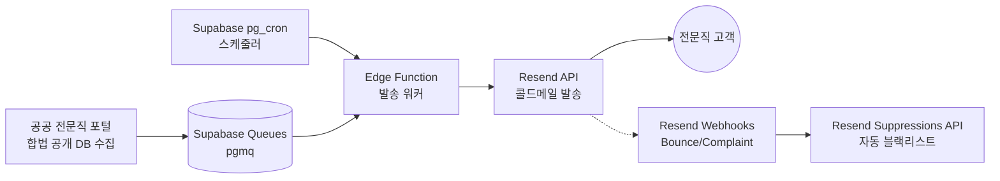
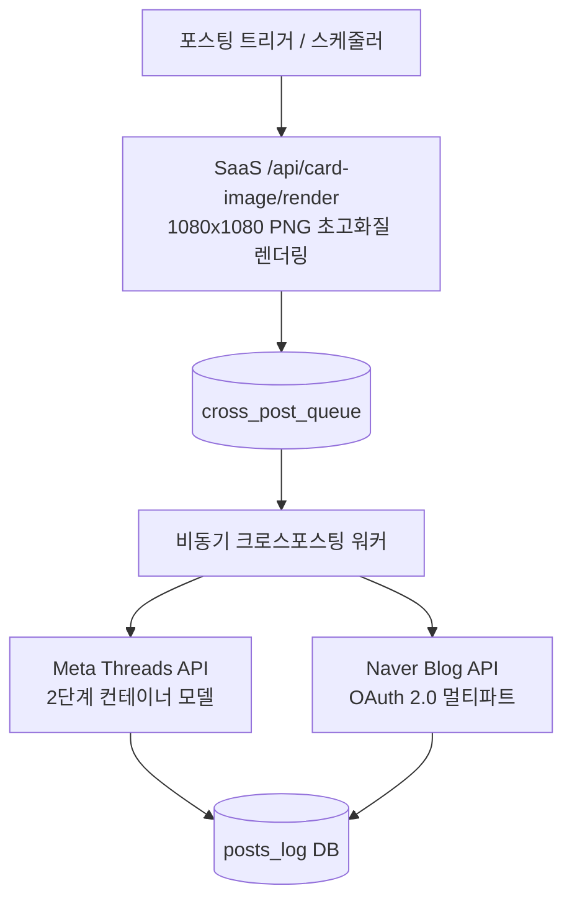
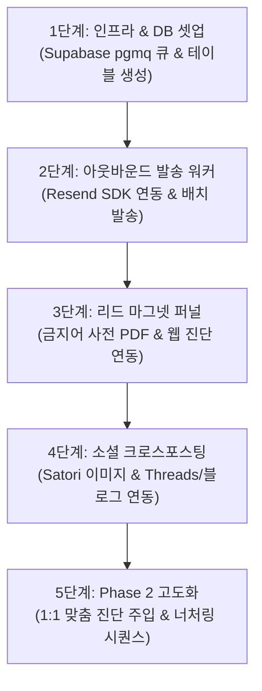

# 🚀 PostSynk SaaS 마케팅 자동화 에이전트 연동 기술 명세서
> **문서 버전:** v1.0.0 (2026)  
> **문서 목적:** 외부 작업 폴더 및 독립 프로젝트에서 PostSynk SaaS를 위한 **아웃바운드 콜드메일 에이전트**, **소셜 미디어 크로스포스팅 에이전트**, **리드 마그넷 전환 퍼널**을 구축할 수 있도록 SaaS 내부 스펙, API 규격, DB 스키마, 브랜딩 자산을 완벽히 정의함.

---

## 📑 목차
1. [SaaS 개요 및 핵심 가치 제안 (Value Proposition)](#1-saas-개요-및-핵심-가치-제안)
2. [PostSynk 기술 스택 및 내부 엔드포인트 자산](#2-postsynk-기술-스택-및-내부-엔드포인트-자산)
3. [에이전트 1: 아웃바운드 타겟 DB 스크래핑 & 콜드 메일 자동화 파이프라인](#3-에이전트-1-아웃바운드-타겟-db-스크래핑--콜드-메일-자동화-파이프라인)
4. [에이전트 2: 인바운드 소셜 미디어 크로스포스팅 에이전트 (Threads & Naver Blog)](#4-에이전트-2-인바운드-소셜-미디어-크로스포스팅-에이전트)
5. [리드 마그넷 기획 및 고관여 DB 수집 자동화](#5-리드-마그넷-기획-및-고관여-db-수집-자동화)
6. [통합 데이터베이스 스키마 (Supabase SQL & pgmq)](#6-통합-데이터베이스-스키마-supabase-sql--pgmq)
7. [환경 변수 및 API Key 명세](#7-환경-변수-및-api-key-명세)
8. [Phase 2 마케팅 고도화 로드맵 (전환율 3~5배 극대화 킬러 기능)](#8-phase-2-마케팅-고도화-로드맵-전환율-35배-극대화-킬러-기능)
9. [새 프로젝트 AI 에이전트 전용 단계별 실행 가이드 (Step-by-Step)](#9--새-프로젝트-ai-에이전트-전용-단계별-실행-가이드-step-by-step)

---

## 1. SaaS 개요 및 핵심 가치 제안

### 1.1 브랜드 및 프로덕트 정보
* **서비스명:** PostSynk (포스트싱크)
* **슬로건:** "전문직 네이버 블로그 SEO 및 인포그래픽 1초 자동 완성 SaaS"
* **핵심 타깃(ICP):** 변호사, 세무사, 회계사, 노무사, 행정사, 의사/한의사 등 라이선스 전문직 및 중대형 법인

### 1.2 해결하는 핵심 고통 (Pain Points)
1. **외주 대행사의 막대한 비용 및 품질 불만:** 월 150~300만 원 지출에도 기계적 양산형 글, 네이버 저품질/유사문서 누락 발생.
2. **전문직 광고 규정 위반 공포:** 변호사법 제23조, 세무사법, 의료법 위반(과대/과장 광고, 최고/유일/100% 승소 등 금지어 사용 시 징계 및 과태료 위험).
3. **법령 및 판례 환각(Hallucination):** 일반 AI(ChatGPT) 사용 시 존재하지 않는 엉터리 판례나 폐지된 조세 조항 창작 위험.

### 1.3 PostSynk의 독보적 차별점 (Killer Features)
* **C-Rank & DIA+ 완벽 준수:** 네이버 스마트블록/스마트에디터 ONE 전용 인라인 CSS 스타일 및 1인칭 실무 경험 스토리텔링 강제.
* **실시간 공공 RAG 팩트체크:** 대법원, 국세청, 법제처, 고용노동부 최신 공식 데이터를 2초 내에 실시간 결합.
* **1080x1080 초고화질 인포그래픽 9종 자동 생성:** Satori/Edge 기반으로 썸네일, 체크리스트, Before/After 비교, Q&A, 리스크 경고 등 카드 이미지를 1초 만에 렌더링.
* **광고법 금지어 2중 필터링:** 과장/보장성 문구를 사전 차단하여 100% 합법적이고 신뢰도 높은 전문직 칼럼 완성.

---

## 2. PostSynk 기술 스택 및 내부 엔드포인트 자산

### 2.1 코어 인프라
* **Framework:** Next.js 16 (Turbopack, App Router)
* **Database & Auth:** Supabase (PostgreSQL, Supabase Auth) + Prisma ORM
* **AI Provider:** OpenAI (`gpt-5.6-terra`, `gpt-5.6-luna`), Google Gemini (`gemini-3.6-flash`, `gemini-3.7-flash`)
* **Image Engine:** `@vercel/og` (Satori 렌더링 엔진)
* **Mail Delivery:** Resend SDK

### 2.2 마케팅 에이전트가 활용 가능한 SaaS 내부 엔드포인트

| 엔드포인트 | Method | 역할 및 활용 방안 |
| :--- | :---: | :--- |
| `/api/card-image/render` | `GET` | **1080x1080 SNS 카드/인포그래픽 이미지 즉시 생성** (Threads, 블로그 포스팅용 이미지 렌더링) |
| `/api/seo-check/analyze` | `POST` | **네이버 블로그 실시간 팩트/광고법 진단 API** (리드 마그넷 자가 진단 툴 백엔드로 활용) |
| `/api/generate-seo` | `POST` | **전문직 SEO 블로그 본문 실시간 스트리밍 생성** (AI 크로스포스팅 본문 생성) |
| `/seo-check` | `PAGE` | **무료 블로그 진단 랜딩 페이지** (콜드메일 및 SNS 유입 전환 페이지) |

---

## 3. 에이전트 1: 아웃바운드 타겟 DB 스크래핑 & 콜드 메일 자동화 파이프라인



### 3.1 타겟 DB 스크래핑 가이드 (합법성 준수)
* **수집 출처:** 대한변호사협회 검색 포털, 한국세무사회 전문인 검색, 행정사/노무사 공개 디렉토리 등 공공기관에 합법적으로 공개된 사업용 대표 이메일/사무소 주소.
* **수집 필드:** `이름`, `전문분야(이혼/상속/세무조사 등)`, `사무소 상호명`, `지역(구/동 단위)`, `공개 이메일 주소`, `블로그 URL(존재 시)`

### 3.2 Supabase Queues (pgmq) & pg_cron 아키텍처
* **Supabase Queues (`pgmq`):** 데이터베이스 트랜잭션과 100% 일치하는 Exactly-once 발송 큐.
* **스케줄링 주기:** `pg_cron`을 통해 5분마다 최대 20건씩 순차 발송 (발송 도메인 SPF/DKIM 평판 보호).
* **배치 프로세스:**
  1. `pgmq.read('cold_email_queue', 300, 20)` 으로 큐 메시지 조회
  2. Resend SDK `resend.emails.send()` 호출
  3. 성공 시 `pgmq.archive()` 또는 `pgmq.delete()` 처리

### 3.3 Resend SDK 발송 및 수신거부/바운스 관리
* **Resend Webhook 설정 이벤트:**
  - `email.bounced` (영구적 반송)
  - `email.complained` (스팸 신고)
* **웹훅 처리:** 해당 이메일을 수신하는 즉시 Resend Suppressions API (`resend.suppressions.add({ email })`)를 호출하여 향후 발송에서 영구 제외.
* **법적 필수 준수:** 메일 본문 최하단에 `[수신 거부(Unsubscribe)]` 원클릭 링크 및 사업자 정보 명시.

### 3.4 전문직 고전환 콜드 메일 카피 템플릿 (A/B)

#### ✉️ [Template A: 변호사/세무사 광고법 과태료 리스크 환기형]
```text
제목: [{{store_name}}] 대표 {{industry}}님, 블로그에 '이 단어' 들어가 있으면 과태료 대상입니다.

안녕하세요, {{store_name}} {{name}} {{industry}}님.
{{region}} 지역 전문직 로컬 마케팅을 분석하는 PostSynk 연구팀입니다.

최근 2025~2026년 협회 징계 사례에 따르면, 블로그에 무심코 작성한 "100% 승소", "최대 절세", "독보적" 등의 단어로 인해 민원 및 과태료 처분을 받는 사무소가 급증하고 있습니다.

저희가 개발한 '전문직 팩트체크 엔진'으로 {{store_name}} 블로그를 1초 만에 무료 진단해 드립니다.

👉 [내 블로그 광고법 위반 및 SEO 1초 무료 진단하기] (링크)

또한 답장으로 "자료 요청"이라고 회신해 주시면, 대한변협/세무사회 최신 징계 분석 보고서인 [2026 전문직 광고법 금지어 사전 PDF]를 즉시 발송해 드리겠습니다.

감사합니다.
PostSynk 드림
(수신거부: 하단 링크 클릭)
```

---

## 4. 에이전트 2: 인바운드 소셜 미디어 크로스포스팅 에이전트



### 4.1 1080x1080 인포그래픽 미디어 렌더링 규격
PostSynk의 내장 이미지 렌더러 엔드포인트를 그대로 호출하여 고화질 카드를 생성합니다:

```http
GET https://[YOUR-POSTSYNK-DOMAIN]/api/card-image/render?type={CardType}&title={Title}&category={Category}&extra1={Extra1}&extra2={Extra2}&seed={Seed}
```

* **지원 CardType 9종:**
  1. `MAIN_THUMBNAIL`: 인스타/스레드 최적 1:1 대표 썸네일
  2. `CHECKLIST`: 필수 준비 서류/요건 점검 리스트
  3. `COMPARISON`: 잘못된 대처 vs 전문가 해결 Before/After
  4. `STAT_HIGHLIGHT`: 핵심 감면율/공제액 수치 강조
  5. `PROCESS_FLOW`: 3단계 절차 로드맵
  6. `QNA`: 자주 묻는 질문 & 팩트 해설
  7. `WARNING_RISK`: 골든타임 경고 및 패널티 리스크
  8. `KEY_TAKEAWAYS`: 3줄 요약 결론 카드
  9. `CTA_FOOTER`: 상담 직통 전화 및 지도 배너

### 4.2 Meta Threads API 연동 (엄격한 2단계 컨테이너 모델)
Meta Threads API는 직접 즉시 발행을 지원하지 않으며, 미디어 처리 대기 시간을 반드시 둬야 합니다.

```typescript
// 1단계: 미디어 컨테이너 생성
const containerRes = await fetch(`https://graph.threads.net/v1.0/${threadsUserId}/threads`, {
  method: 'POST',
  headers: { 'Content-Type': 'application/json' },
  body: JSON.stringify({
    media_type: 'IMAGE',
    image_url: renderedCardImageUrl, // PostSynk 렌더링 이미지
    text: postTextContent + '\n\n👉 무료 전문직 블로그 진단: ' + landingUrl,
    access_token: threadsAccessToken,
  })
});
const { id: creationId } = await containerRes.json();

// 2단계: Meta 서버 미디어 인코딩 30초 대기 (Delay)
await new Promise((resolve) => setTimeout(resolve, 30000));

// 3단계: 최종 발행 요청
const publishRes = await fetch(`https://graph.threads.net/v1.0/${threadsUserId}/threads_publish`, {
  method: 'POST',
  headers: { 'Content-Type': 'application/json' },
  body: JSON.stringify({
    creation_id: creationId,
    access_token: threadsAccessToken,
  })
});
```
* **주의 사항:** 계정당 일일 250건 제한, 실패 시 60초 지수 백오프(Exponential Backoff) 적용.

### 4.3 Naver Blog API 연동
* **엔드포인트:** `https://openapi.naver.com/blog/writePost.json`
* **인증:** OAuth 2.0 Access Token Bearer 헤더
* **포맷:** Multipart Form-data (제목 `title`, 본문 HTML `contents`, 이미지 파일 바이너리 `image`)

---

## 5. 리드 마그넷 기획 및 고관여 DB 수집 자동화

### 5.1 리드 마그넷 1: "2026 전문직 광고법 위반 금지어 사전 & 자가 진단 키트"
* **구성:**
  1. **PDF 리포트:** 2025~2026년 최신 변협/세무사회 징계 분석, 20대 핵심 금지어 목록 및 합법적 대체 문장 사전.
  2. **웹 진단 툴:** PostSynk의 `/api/seo-check/analyze` API와 연동하여, 내 블로그 글을 복사해 넣으면 금지어와 저품질 요소를 실시간 하이라이트.
* **내장 금지어 사전 데이터 (`AD_LAW_PROHIBITED_WORDS`):**
  `'100% 승소'`, `'완치'`, `'최고의'`, `'최고'`, `'무조건'`, `'단언컨대'`, `'무죄 보장'`, `'승소 보장'`, `'승소율 1위'`, `'국내 유일'`, `'전국 1위'`, `'업계 1위'`, `'부작용 없는'`, `'환불 보장'`, `'완벽한 치료'`, `'절대적'`, `'최저가'`, `'독보적'` 등.

### 5.2 리드 마그넷 2: "수임률 300% 대법원 판례 인용 블로그 템플릿 팩"
* **구성:**
  - [Hook]: 의뢰인이 가장 불안해하는 공통 위기 진단
  - [Evidence]: 신뢰도를 극대화하는 대법원 최신 판례/세법 조항 인용 뼈대
  - [Action Plan]: 전문가 1인칭 조력 및 1:1 상담 안내 CTA
* **배포 자동화:** 랜딩페이지 폼 제출 ➔ Supabase 리드 테이블 적재 ➔ Resend 이메일 즉시 자동 발송.

---

## 6. 통합 데이터베이스 스키마 (Supabase SQL & pgmq)

외부 마케팅 에이전트 프로젝트에서 바로 적용할 수 있는 PostgreSQL / Supabase 테이블 스키마입니다:

```sql
-- 1. pgmq 및 pg_cron 확장 활성화
create extension if not exists pgmq cascade;
create extension if not exists pg_cron cascade;

-- 2. 콜드메일 큐 및 소셜 발행 큐 생성
select pgmq.create('cold_email_queue');
select pgmq.create('cross_post_queue');

-- 3. 수집된 잠재고객 리드 DB (Leads Table)
create table if not exists marketing_leads (
  id uuid primary key default gen_random_uuid(),
  email text unique not null,
  name text,
  industry text, -- '변호사', '세무사', '노무사', '의사' 등
  store_name text,
  region text,
  source text default 'outbound_scrape', -- 'outbound_scrape', 'lead_magnet_pdf', 'seo_check_tool'
  status text default 'PENDING', -- 'PENDING', 'SENT', 'OPENED', 'CONVERTED', 'BOUNCED', 'UNSUBSCRIBED'
  lead_magnet_sent boolean default false,
  created_at timestamptz default now()
);

-- 4. 크로스포스팅 발행 이력 테이블 (Posts Log)
create table if not exists cross_posts_log (
  id uuid primary key default gen_random_uuid(),
  platform text not null, -- 'THREADS', 'NAVER_BLOG', 'INSTAGRAM'
  target_keyword text not null,
  post_title text not null,
  image_url text,
  external_post_url text,
  status text default 'SUCCESS', -- 'SUCCESS', 'FAILED'
  error_message text,
  published_at timestamptz default now()
);

-- 5. pg_cron 스케줄러 등록 (매 5분마다 발송 Edge Function 트리거 예시)
-- select cron.schedule('process-cold-emails', '*/5 * * * *', $$
--   select net.http_post(
--     url := 'https://[YOUR_SUPABASE_PROJECT].supabase.co/functions/v1/process-cold-email',
--     headers := '{"Content-Type": "application/json", "Authorization": "Bearer [SERVICE_ROLE_KEY]"}'::jsonb,
--     body := '{}'::jsonb
--   );
-- $$);
```

---

## 7. 환경 변수 및 API Key 명세

마케팅 자동화 에이전트 프로젝트의 `.env`에 설정할 항목들입니다:

```env
# 1. PostSynk SaaS 연동
POSTSYNK_BASE_URL=https://[YOUR-POSTSYNK-APP-DOMAIN]
POSTSYNK_SERVICE_API_KEY=[INTERNAL_SECRET_OR_ADMIN_KEY]

# 2. Supabase 인프라
NEXT_PUBLIC_SUPABASE_URL=https://[PROJECT-REF].supabase.co
SUPABASE_SERVICE_ROLE_KEY=[SUPABASE-SERVICE-ROLE-KEY]

# 3. Resend 이메일 발송 & 웹훅
RESEND_API_KEY=re_xxxxxxxxxxxxxx
RESEND_FROM_EMAIL=PostSynk 연구팀 <contact@your-verified-domain.com>

# 4. Meta Threads API
THREADS_APP_ID=[META_APP_ID]
THREADS_APP_SECRET=[META_APP_SECRET]
THREADS_USER_ID=[THREADS_USER_ID]
THREADS_ACCESS_TOKEN=[LONG_LIVED_THREADS_USER_ACCESS_TOKEN]

# 5. Naver Blog API
NAVER_CLIENT_ID=[NAVER_DEVELOPER_CLIENT_ID]
NAVER_CLIENT_SECRET=[NAVER_DEVELOPER_CLIENT_SECRET]
NAVER_BLOG_ACCESS_TOKEN=[NAVER_OAUTH_ACCESS_TOKEN]

# 6. AI 생성 보조 (필요 시)
OPENAI_API_KEY=sk-proj-xxxxxxxxxxxx
```

---

## 8. Phase 2 마케팅 고도화 로드맵 (전환율 3~5배 극대화 킬러 기능)

기본 파이프라인(Phase 1) 구축 완료 후, 결제 전환율 및 리드 유입량을 극대화하기 위해 단계별로 추가 구현할 4대 킬러 확장 기능입니다:

### 8.1 🎯 [초개인화] 1:1 맞춤 블로그 사전 진단 첨부 콜드메일 에이전트
* **개념:** 스크래핑한 타깃 변호사/세무사의 실제 네이버 블로그 최신 글 1편을 PostSynk의 `/api/seo-check/analyze` 엔드포인트로 백그라운드에서 자동 사전 진단.
* **작동 메커니즘:**
  1. 수집된 블로그 URL로부터 최신 글 추출
  2. `/api/seo-check/analyze` 호출 ➔ 점수(Score), 글자 수, 이미지 수, 발견된 광고법 금지어(`AD_LAW_PROHIBITED_WORDS`) 파싱
  3. 콜드메일 본문에 맞춤 동적 주입:
     > *"{{name}} {{industry}}님, 최근 작성하신 '{{post_title}}' 포스팅을 진단한 결과, 종합 점수는 **{{score}}점**이며, **'{{prohibited_word}}' 등 광고법 주의 단어 {{count}}건**이 발견되었습니다. [1초 상세 리포트 확인하기]"*
* **기대 효과:** 스팸으로 버려지지 않고 실제 본인 사무소의 결함을 짚어주므로 **오픈율 60%+, 클릭률 25%+ 달성 (일반 콜드메일 대비 3~5배)**.

### 8.2 💬 [Threads 바이럴] '댓글 시 자동 전송' 인게이지먼트 루프 봇
* **개념:** Threads 알고리즘은 '댓글 수(Comments)'가 많은 게시물을 피드 최상단 및 탐색 탭에 바이럴 노출시킴.
* **작동 메커니즘:**
  1. Threads 포스팅 하단에 *"댓글에 **'사전'**이라고 남겨주시면 [2026 전문직 광고법 금지어 PDF]를 즉시 보내드립니다"* 트리거 삽입
  2. Webhook 또는 폴링 워커로 게시글 댓글 실시간 감지
  3. 특정 키워드('사전', '자료', '진단') 감지 시 해당 사용자에게 자동 답글/DM으로 다운로드 링크 전송
* **기대 효과:** 팔로워가 없는 신규 계정도 게시물당 **1만~5만 노출 바이럴 루프** 형성.

### 8.3 🚨 [실시간 수임 기회] 네이버 지식iN 실시간 수임 쟁점 감지 & 데일리 브리핑
* **개념:** 네이버 지식iN/포털에 오늘 실시간으로 올라온 고단가 사건/세무 상담 질문을 크롤링하여 전문직 고객에게 데일리 콘텐츠 힌트 제공.
* **작동 메커니즘:**
  1. "상속세 세무조사", "자금조달계획서 소명", "이혼 재산분할" 등 고단가 시드 쿼리로 지식iN 실시간 모니터링
  2. 당일 주요 이슈를 요약하여 가입 고객에게 매일 아침 알림 메일/카톡 발송:
     > *"오늘 송파구/강남구에 '양도세 비과세 분쟁' 질문이 5건 등록되었습니다. PostSynk에서 1초 만에 최적화 블로그 글을 생성하고 의뢰인을 선점하세요!"*
* **기대 효과:** SaaS의 **일간 활성 사용자(DAU) 및 구독 유지율(Retention) 극대화**.

### 8.4 📬 [D+3 / D+7 골든타임] 무료체험 미결제자 자동 너처링(Nurturing) 시퀀스
* **개념:** 무료 체험 3회를 모두 소진했으나 유료 플랜으로 결제하지 않은 리드(Cold Lead)를 유료 결제로 전환시키는 자동 이메일 시퀀스.
* **시퀀스 설계:**
  - **D+1일차:** *"대표님, 어제 작성하신 글은 네이버 스마트에디터에 복사해 보셨나요? (1초 복사 꿀팁)"*
  - **D+3일차:** *"이번 주 상위 1% 세무사들이 가장 많이 발행한 3대 고단가 키워드 리포트 공유"*
  - **D+7일차:** *"마감 임박: Pro 플랜 50% 평생 할인 프로모션 코드 (선착순 10명)"*
* **기대 효과:** 이탈할 뻔한 무료 회원의 **유료 결제 전환율 20~30% 추가 회수**.

---

## 9. 📋 새 프로젝트 AI 에이전트 전용 단계별 실행 가이드 (Step-by-Step)

새 프로젝트의 AI 에이전트는 아래 5단계 순서대로 작업을 진행하면 됩니다. 각 단계별로 필요한 모든 DDL, API 규격, 템플릿은 본 문서에 이미 포함되어 있습니다.



### [Step 1] 인프라 & 데이터베이스 셋업
* **작업 내용:** Section 6의 SQL 스크립트를 Supabase SQL Editor에 실행하여 `marketing_leads`, `cross_posts_log` 테이블 및 `pgmq` 큐(`cold_email_queue`, `cross_post_queue`) 생성.
* **프롬프트:** `"Section 6의 SQL 스키마를 기반으로 Supabase 클라이언트 및 DB 연동 모듈을 설정해줘."`

### [Step 2] 아웃바운드 콜드메일 발송 파이프라인
* **작업 내용:** Section 3의 규격에 맞춰 pgmq에서 20건씩 메시지를 읽어와 Resend SDK로 전송하고, 바운스/수신거부 웹훅을 처리하는 Edge Function / 백그라운드 워커 구현.
* **프롬프트:** `"Section 3을 참조하여 Supabase pgmq에서 타깃 리드를 읽어 Resend로 콜드메일을 발송하고, 바운스 웹훅을 처리하는 워커 스크립트를 작성해줘."`

### [Step 3] 리드 마그넷 및 자가 진단 퍼널
* **작업 내용:** Section 5의 `AD_LAW_PROHIBITED_WORDS` 데이터를 활용하여, 포털 주소나 텍스트 입력 시 광고법 금지어를 하이라이트하고 이메일 제출 시 PDF를 자동 발송하는 랜딩 페이지 폼 구현.
* **프롬프트:** `"Section 5를 참조하여 2026 광고법 금지어 자가 진단 웹 툴 및 이메일 입력 시 PDF 자동 발송 로직을 구현해줘."`

### [Step 4] 인바운드 소셜 미디어 크로스포스팅
* **작업 내용:** Section 4의 1080x1080 렌더러(`/api/card-image/render`)와 Meta Threads API(2단계 컨테이너 모델) 및 Naver Blog API 멀티파트 발행 연동.
* **프롬프트:** `"Section 4의 Meta Threads API 2단계 컨테이너 모델 및 Naver Blog API 발행 로직을 cross_post_queue 워커로 구현해줘."`

### [Step 5] Phase 2 킬러 기능 고도화
* **작업 내용:** Section 8의 4대 로드맵(1:1 맞춤 사전 진단 메일 주입, Threads 댓글 자동 응답 봇, 지식iN 쟁점 브리핑, D+3/D+7 너처링 시퀀스)을 순차 적용.

---

### 💡 새 프로젝트 시작용 원클릭 마스터 프롬프트 (Copy & Paste)

새 작업 폴더에서 새로운 AI 에이전트와 대화를 시작할 때 아래 문장을 그대로 복사해서 붙여넣으세요:

> **"현재 폴더의 `POSTSYNK_MARKETING_AGENT_SPEC.md` 문서를 읽고, Section 9의 [Step 1: 인프라 & DB 셋업]부터 차례대로 구현을 시작해줘."**


