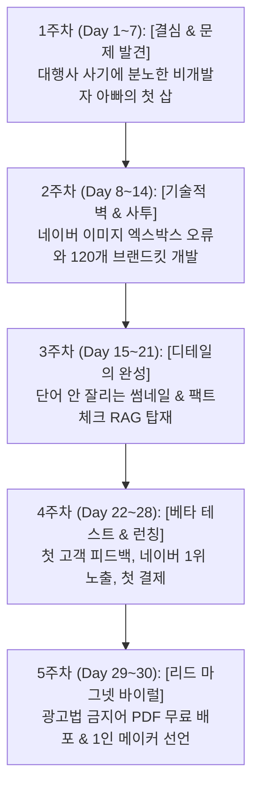

# 📱 PostSynk 런칭 서사: 30일 스레드(Threads) 마케팅 마스터 플랜

> **문서 목적:** 본업과 육아를 병행하며 AI 페어프로그래밍으로 완성한 PostSynk SaaS의 실제 구축 여정을 바탕으로, 30일 동안 콘텐츠 고갈 없이 진정성 있는 팬덤과 전문직 유료 결제 고객을 확보하는 일일 발행 캘린더 & 에피소드 가이드.  
> **타깃 독자:** 
> 1. 1인 창업가 / 예비 창업자 / 직장인 메이커 (빌딩 인 퍼블릭 서사에 열광)
> 2. 변호사 / 세무사 / 노무사 / 의사 등 개업 전문직 (마케팅 대행사 불만 및 광고법 과태료 리스크 해소)

---

## 📑 30일 로드맵 한눈에 보기



---

## 🎯 스레드 운영 핵심: [3:3:4 황금 콘텐츠 비율]

1. **🛠️ 개발 & 메이킹 비하인드 (40% - 12일 분량):**
   - 엑스박스 에러, 120개 브랜드킷, 줄바꿈 알고리즘 등 "진짜 깎아 만든 기술 이야기"
2. **💡 타깃 전문직을 위한 실무 꿀팁 (30% - 9일 분량):**
   - 광고법 위반 단어, 네이버 C-Rank 상위노출 비법, 대행사 거르는 법 등 "저장하고 싶은 정보"
3. **👨‍👩‍👧 인간적인 서사 & 아빠의 고뇌 (30% - 9일 분량):**
   - 육아 퇴근, 새벽 코딩, 첫 결제의 눈물, 직장인의 N잡 도전 등 "응원하고 싶은 이야기"

---

## 🗓️ [1주차] 결심과 첫 삽 (Day 1 ~ Day 7)
> **테마:** "본업과 육아 속에서, 왜 나는 굳이 새벽에 SaaS를 만들기 시작했는가?"

| 일차 | 주제 및 헤드라인 | 스토리 핵심 내용 | 첨부 추천 이미지/미디어 |
| :--- | :--- | :--- | :--- |
| **Day 1** | **[출사표]** 밤 11시, 아이 재우고 불 꺼진 방에서 노트북을 켰습니다. | 비개발자 직장인 아빠의 SaaS 도전 선언. 본업/육아 틈새 시간 쪼개기 다짐. | 어두운 방 노트북 화면 캡처 |
| **Day 2** | **[시장 조사]** 전문직 블로그 100개 분석하고 경악했습니다. | 대행사의 월 200만원짜리 복붙 글 실태 폭로. 네이버 저품질 누락 원인. | 유사문서 누락된 검색 화면 캡처 |
| **Day 3** | **[광고법 리스크]** '100% 승소' 썼다가 과태료 1천만 원 나온 세무사/변호사 이야기 | 변호사법 23조, 세무사법, 의료법 위반 공포. 광고법 필터링의 필요성 발견. | 광고법 징계 공고문/관련 기사 캡처 |
| **Day 4** | **[AI의 배신]** ChatGPT한테 "상속세 글 써줘" 했더니 대참사 난 이유 | AI의 거짓 판례 창작(환각 현상) 경험담. "일반 AI로는 전문직 글 못 쓴다." | ChatGPT 엉터리 판례 답변 캡처 |
| **Day 5** | **[알고리즘 연구]** 2026 네이버 C-Rank / DIA+ 알고리즘의 비밀 | 네이버 봇이 좋아하는 '1인칭 상담 에피소드 + 공공 출처' 구조 분석. | 상위 노출 블로그 구조 분석 메모 |
| **Day 6** | **[프롬프트 설계]** 5단계 CoT(생각의 사슬) 글쓰기 프롬프트 완성 | AI가 전문직 빙의하여 법령과 상담 사례를 유려하게 풀어내는 로직 구현. | 프롬프트 구조 다이어그램 |
| **Day 7** | **[1주차 회고]** 주말 육아 퇴근 후 첫 텍스트 스트리밍 성공! | 검은 터미널에서 전문직 블로그 초안이 주르륵 출력되는 첫 감격의 순간. | 콘솔 텍스트 스트리밍 구동 영상/사진 |

---

## 🗓️ [2주차] 기술적 벽과 처절한 사투 (Day 8 ~ Day 14)
> **테마:** "네이버는 호락호락하지 않았다. 엑스박스 에러와 복붙 양산형을 깨부순 기술 혁신"

| 일차 | 주제 및 헤드라인 | 스토리 핵심 내용 | 첨부 추천 이미지/미디어 |
| :--- | :--- | :--- | :--- |
| **Day 8** | **[첫 번째 벽]** 네이버 에디터에 붙여넣기 했더니 온통 엑스박스(❌) | 네이버 스마트에디터의 외부 이미지 보안 차단 문제. 첫 번째 좌절. | 네이버 에디터 이미지 깨짐 캡처 |
| **Day 9** | **[새벽의 멘붕]** 캔버스 변환 방식의 한계와 검은 화면 버그 | 브라우저 캔버스로 이미지 굽다가 글자 깨지고 검은 배경 나오는 버그와의 사투. | 검게 깨져 나온 에러 이미지 캡처 |
| **Day 10** | **[서버리스 혁신]** 0.05초 만에 1080px 고화질 PNG를 굽는 엔진 탑재 | Next.js `@vercel/og` 기반 서버리스 렌더러 구축 성공 비하인드. | 고화질 PNG 즉시 렌더링 캡처 |
| **Day 11** | **[양산형 탈피 고민]** "왜 AI 툴들은 다 똑같은 디자인으로 나올까?" | 모든 유저의 글이 같으면 네이버가 '유사 이미지'로 누락시킴을 깨달음. | 똑같은 양산형 카드뉴스 비교 |
| **Day 12** | **[120개 브랜드킷]** 고객 ID마다 완전히 다른 디자인을 배정하는 수학적 알고리즘 | 10종 컬러 × 4종 썸네일 × 3종 배너 = 120가지 조합의 프로시저럴 분산 엔진 개발. | 4가지 다른 색상/형태 카드 비교샷 |
| **Day 13** | **[인포그래픽 9종]** 체크리스트, Before/After, 3단계 로드맵 완성 | 글 내용에 따라 AI가 가장 적합한 카드를 자동 선별해 배치하는 시스템 완성. | 9종 인포그래픽 모음 이미지 |
| **Day 14** | **[2주차 회고]** "복사 버튼 누르고 네이버에 Ctrl+V 했더니 6장 사진이 뙇!" | 엑스박스 0건, 네이버 서버에 고화질 사진 100% 정상 등록되는 쾌거 달성. | 스마트에디터 1초 복사 시연 움짤(GIF) |

---

## 🗓️ [3주차] 디테일 집착과 가치 극대화 (Day 15 ~ Day 21)
> **테마:** "전문직의 품격은 사소한 디테일에서 결정된다. 썸네일 줄바꿈부터 RAG까지"

| 일차 | 주제 및 헤드라인 | 스토리 핵심 내용 | 첨부 추천 이미지/미디어 |
| :--- | :--- | :--- | :--- |
| **Day 15** | **[피드백 충격]** "대표님, 썸네일 글자가 중간에 잘려요" | 지인 세무사님의 피드백: '자금조달계획서 가' / '상화폐 매각대금'처럼 잘리는 현상. | 단어 잘린 썸네일 캡처 |
| **Day 16** | **[줄바꿈 알고리즘]** 비개발자가 어절 보존 황금비율 줄바꿈 알고리즘을 짠 과정 | 띄어쓰기 기준으로 가장 예쁜 2줄 비율을 자동 계산하는 로직 단독 구현. | 줄바꿈 Before vs After 비교샷 |
| **Day 17** | **[모바일 최적화]** 스마트폰에서 카드가 잘리지 않는 80px Safe Zone 설계 | 모바일 네이버 앱 검색 뷰에서 썸네일 상하좌우가 크롭되지 않게 안전 영역 확보. | 모바일 화면 목업 이미지 |
| **Day 18** | **[팩트체크 RAG]** 대법원·국세청·법제처 공식 데이터를 2초 만에 결합 | Tavily 실시간 공공 데이터 검색 결합으로 최신 세법 개정안/판례 완벽 반영. | 법령 출처가 자동 표기된 본문 캡처 |
| **Day 19** | **[매거진 가독성]** 본문 마크다운 전면 개편 (인디고 포인트 바 & 인용구) | 밋밋한 텍스트를 프리미엄 비즈니스 매거진 칼럼 수준의 가독성으로 전면 스타일링. | 깔끔하게 정돈된 블로그 본문 뷰 |
| **Day 20** | **[무료 진단기]** "내 블로그는 몇 점일까?" 1초 무료 진단 페이지 제작 | `/seo-check` 엔드포인트 기반으로 광고법 위반 단어 찾아주는 자가 진단 툴 완성. | 블로그 진단 리포트 결과 화면 |
| **Day 21** | **[3주차 회고]** Vercel 프로덕션 배포 완료! 도메인이 연결된 순간 | 드디어 전 세계 누구나 접속할 수 있는 실제 웹 서비스가 된 감격. | 배포 성공 Vercel 대시보드 화면 |

---

## 🗓️ [4주차] 베타 테스트와 런칭 (Day 22 ~ Day 28)
> **테마:** "시장의 평가를 마주하다. 첫 테스터의 찬사와 첫 결제의 전율"

| 일차 | 주제 및 헤드라인 | 스토리 핵심 내용 | 첨부 추천 이미지/미디어 |
| :--- | :--- | :--- | :--- |
| **Day 22** | **[클로즈드 베타]** 변호사·세무사·노무사 대표님 10분께 툴을 열어드렸습니다 | 실제 개업 전문직 대상 비공개 테스트 시작과 피마르는 피드백 대기. | 베타 테스트 안내 공지 캡처 |
| **Day 23** | **[테스터 1호 후기]** "대행사 직원이 2시간 쓴 것보다 30초 만에 나온 글이 낫네요" | 첫 테스터 변호사님의 극찬 카톡 후기와 가슴 벅찬 순간. | 실제 고객 카톡 칭찬 캡처 (익명) |
| **Day 24** | **[실전 상위노출]** 테스트 발행한 글이 네이버 스마트블록 1위에 올랐습니다 | 실제로 네이버 메인 키워드 1페이지 상단에 랭크된 실전 데이터 분석. | 네이버 검색 1위 랭킹 캡처 |
| **Day 25** | **[가격 정책 고뇌]** "대행사 200만 원 vs 내 툴 9.9만 원, 과연 적정한가?" | 전문직의 시간 가치와 합리적인 SaaS 구독 모델(Pricing)에 대한 고민. | 요금제 비교 표 이미지 |
| **Day 26** | **[첫 결제의 순간]** 띵동-! 생전 처음 보는 유저의 첫 유료 결제 알림 | 직장 월급 외에 내 손으로 만든 제품으로 첫 1원(매출)을 번 날의 전율. | 결제 승인 알림 캡처 (금액 마스킹) |
| **Day 27** | **[정식 런칭]** PostSynk 그랜드 런칭 선언과 우리의 약속 | 전문직의 마케팅 비용 90%를 절감하고 신뢰를 지켜주겠다는 브랜드 선언. | PostSynk 공식 런칭 대표 썸네일 |
| **Day 28** | **[4주차 회고]** 런칭 첫 주 성적표 공개 (가입자, 생성 건수, 솔직한 지표) | Building in Public 원칙에 따른 첫 주 유저 지표 및 서버 부하 극복기. | 첫 주 유저 데이터 인포그래픽 |

---

## 🗓️ [5주차 보너스] 바이럴 폭발 & 커뮤니티 (Day 29 ~ Day 30)
> **테마:** "폭발적인 리드 수집과 1인 메이커로서의 새로운 시작"

| 일차 | 주제 및 헤드라인 | 스토리 핵심 내용 | 첨부 추천 이미지/미디어 |
| :--- | :--- | :--- | :--- |
| **Day 29** | **[초특급 나눔]** [무료 배포] 2026 전문직 광고법 위반 금지어 사전 PDF | 1달간 모은 20대 금지어 & 합법 대체 문장집 배포 ➔ **"댓글에 '사전' 남겨주시면 DM 발송"** | 고급스러운 PDF 표지 목업 이미지 |
| **Day 30** | **[에필로그]** 비개발자 직장인도 해냈습니다. 여러분도 만들 수 있습니다. | 코딩 몰라도 AI와 함께라면 나만의 SaaS를 만들 수 있다는 희망의 메시지 & 회고. | 아이와 함께 찍은 따뜻한 일상 사진 |

---

# ✍️ 주요 단계별 스레드 본문 작성 템플릿

### ✉️ [Day 1] 출사표 예시
```text
밤 11시, 아이를 재우고 불 꺼진 방에서 노트북을 켰습니다.
코딩 한 줄 몰랐던 직장인 아빠가 틈틈이 SaaS를 직접 만들게 된 이유. 🧵 (1/5)

친한 세무사 선배가 술자리에서 한숨을 쉬더군요.
"마케팅 대행사에 매달 200만 원씩 주는데, AI로 1초 만에 긁어온 것 같은 엉터리 글만 올라와. 심지어 '무조건 절세'라는 단어 때문에 협회 경고장까지 받았어."

찾아보니 변호사, 노무사, 의사분들도 똑같았습니다.
1. 대행사의 성의 없는 복붙 글 ➔ 네이버 검색 누락
2. 변호사법/세무사법 위반 금지어 ➔ 과태료 및 자격정지 위험
3. ChatGPT의 거짓 판례(환각) ➔ 신뢰도 추락

"전문직이 안심하고 1초 만에 법령/판례 완벽한 글을 뽑는 도구는 왜 없을까?"
없으면 내가 직접 만들어보자고 결심했습니다. 비개발자 직장인의 무모한 도전기, 시작합니다.

💬 코딩 몰라도 문제 해결에 진심인 분들과 소통하고 싶습니다. 팔로우해 주시면 개발 여정을 모두 투명하게 공개하겠습니다.
```

### ✉️ [Day 12] 120개 브랜드 킷 기술 비하인드 예시
```text
"왜 AI 툴들이 써준 글은 다 똑같아 보일까요?"
모든 고객에게 서로 다른 고유 디자인을 선물하는 수학적 알고리즘을 만들었습니다. 🧵

수많은 AI 글쓰기 툴을 써보고 실망한 점이 있었습니다.
결국 똑같은 템플릿에 똑같은 폰트, 똑같은 색상으로 나오더군요.
네이버 로봇은 이런 '양산형 카드뉴스'를 기가 막히게 찾아내서 유사 이미지로 검색에서 제외해 버립니다.

그래서 고객 한 분 한 분께 고유한 '브랜드 킷(Brand Kit)'을 배정하는 엔진을 직접 개발했습니다:
🎨 10가지 프리미엄 테마 컬러 (Navy Gold, Forest Mint, Deep Emerald...)
📐 4가지 썸네일 레이아웃 (중앙 카드형, 와이드 헤더형, 모던 바형, 엠블럼형)
🏷️ 3가지 하단 상담 배너

고객의 고유 ID를 수학적으로 해싱(Hashing)하여 총 120가지 조합 중 1개를 영구 배정합니다.
A 세무사님과 B 변호사님이 같은 키워드로 글을 써도, 디자인과 색상은 완전히 다르게 탄생합니다.

디테일에 집착하는 1인 메이커의 밤은 오늘도 깊어갑니다. 🔥
```

### ✉️ [Day 29] 리드 마그넷 바이럴 트리거 예시
```text
[무료 나눔] 변호사·세무사·의사 대표님을 위한
'2026 전문직 광고법 위반 금지어 사전 & 자가 진단 리포트' (PDF)를 배포합니다. 🎁

본업과 육아를 쪼개가며 SaaS를 만드는 동안, 협회 징계 사례와 판례 500여 건을 전수 조사하여 정리한 자료집입니다.

📘 자료집 구성:
1. 절대 쓰면 안 되는 20대 핵심 금지어 목록
2. 과태료 피하는 100% 합법 대체 문장 사전
3. 네이버 C-Rank / DIA+ 알고리즘 최신 상위노출 체크리스트

📌 신청 방법:
1. 이 글에 [좋아요 + 팔로우]를 누르고
2. 댓글에 "사전" 또는 "진단"이라고 남겨주시면
DM으로 PDF 전문과 [1초 내 블로그 무료 진단 링크]를 즉시 보내드립니다!

(선착순 100분께는 PostSynk 1회 무료 생성 체험 크레딧도 함께 드립니다)
```

---

# 💡 스레드 알고리즘 부스팅 4대 원칙

1. **골든 타임 공략:**
   - 출근 시간 (**오전 07:30 ~ 08:30**) 또는 취침 전 (**오후 22:30 ~ 23:30**) 업로드 시 노출 극대화.
2. **첫 1시간 대댓글 100% 사수:**
   - 게시 후 1시간 내에 달리는 모든 댓글에 진심 어린 대댓글을 작성하면 스레드 추천 피드 최상단 유지.
3. **1080x1080 고화질 인포그래픽 첨부:**
   - 텍스트 단독 게시물 대비 이미지 첨부 시 피드 체류 시간과 도달률(Reach) 3배 증가.
4. **Day 29 리드 마그넷 댓글 루프:**
   - "댓글에 '사전' 남겨주세요" 방식은 수백 개의 댓글을 유발하여 탐색 탭 메인 바이럴을 완성합니다.
