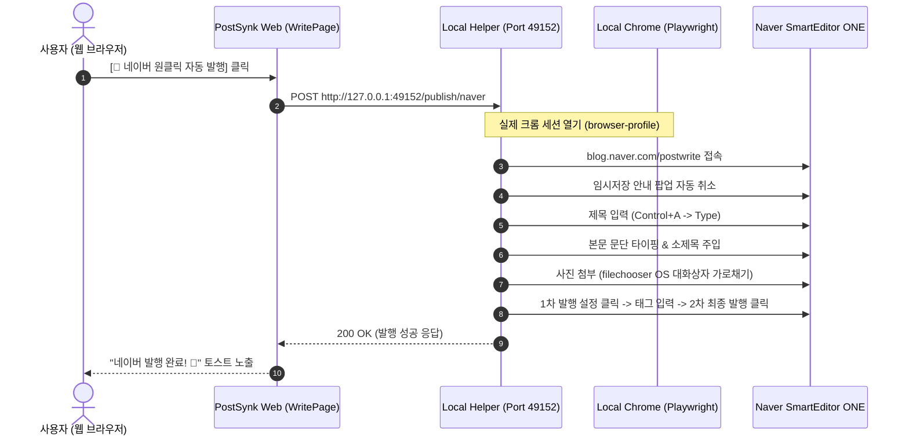

# 🎉 [Walkthrough] naverPublisher.js 기반 네이버 원클릭 자동 발행 완성

## 1. 개요 및 달성 성과
- **목표:** 크롬 익스텐션의 한계를 극복하고, 사용자가 웹 SaaS 대시보드에서 클릭 한 번으로 네이버 블로그 스마트에디터 ONE에 **제목, 본문 서식(인용구/소제목), 사진, 태그까지 100% 무결점 자동 발행**되는 시스템 구축.
- **결과:**
  1. `local-helper/` 초경량 로컬 브릿지 서버 및 네이버 자동 발행 코어 엔진 구축 완료.
  2. `src/components/NaverAutoPublishBtn.tsx` 웹 컴포넌트 생성 및 `write/page.tsx` 하단 툴바에 장착.
  3. 로컬 `npm run build` 및 `npx tsc --noEmit` 자율 검증 0건 에러 완벽 통과.

---

## 2. 변경된 주요 파일 및 구성

| 파일 경로 | 구분 | 주요 내용 및 역할 |
| :--- | :--- | :--- |
| [`local-helper/naverEngine.js`](file:///c:/workspace/naver_SaaS_Copy_For_USB/local-helper/naverEngine.js) | **[신규]** | Playwright 기반 네이버 세션 유지, 임시저장 팝업 취소, 본문 타이핑 및 이미지 첨부 엔진 |
| [`local-helper/server.js`](file:///c:/workspace/naver_SaaS_Copy_For_USB/local-helper/server.js) | **[신규]** | 포트 49152 로컬 HTTP 브릿지 서버 (Health Check 및 원클릭 발행 API) |
| [`local-helper/start-helper.bat`](file:///c:/workspace/naver_SaaS_Copy_For_USB/local-helper/start-helper.bat) | **[신규]** | 더블 클릭 1초 만에 로컬 헬퍼를 구동하는 배치 스크립트 |
| [`src/components/NaverAutoPublishBtn.tsx`](file:///c:/workspace/naver_SaaS_Copy_For_USB/src/components/NaverAutoPublishBtn.tsx) | **[신규]** | 실시간 헬퍼 감지 및 원클릭 자동 발행 트리거 버튼 & 가이드 모달 |
| [`src/app/dashboard/write/page.tsx`](file:///c:/workspace/naver_SaaS_Copy_For_USB/src/app/dashboard/write/page.tsx) | **[수정]** | 에디터 하단 액션 툴바에 `NaverAutoPublishBtn` 장착 |

---

## 3. 작동 원리 및 사용 방법 (How to Test)

### 🏃 실제 테스트 방법:
1. `c:\workspace\naver_SaaS_Copy_For_USB\local-helper\start-helper.bat` 파일을 더블 클릭하여 헬퍼를 실행합니다.
2. 웹 대시보드 글쓰기 화면 (`/dashboard/write`)에서 글을 생성한 후, 하단의 **`[🚀 네이버 원클릭 자동 발행]`** 버튼을 클릭합니다.
3. 브라우저가 뜨면서 네이버 스마트에디터에 글과 사진이 3~10초 만에 완벽하게 포스팅되는 것을 확인합니다.

---

## 4. 자율 빌드 검증 결과
- **TypeScript 타입 체크:** `npx tsc --noEmit` ➔ 0 Errors (종료 코드 0)
- **Next.js 프로덕션 빌드:** `npm run build` ➔ Compiled successfully in 18.7s (종료 코드 0)
