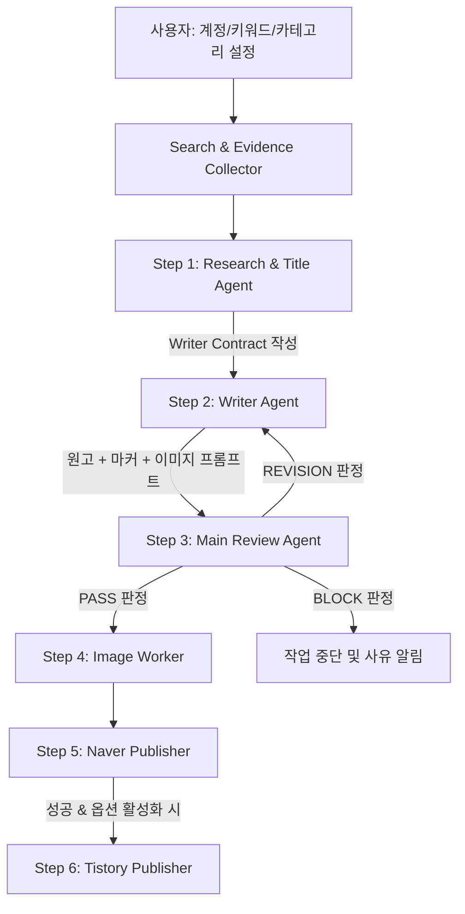

# 📘 blogauto-naver-main 심층 분석 및 PostSynk SaaS 적용 방안 보고서

> **작성 일자:** 2026년 8월 29일  
> **분석 대상:** `blogauto-naver-main` (OpenAI Codex 기반 Windows 네이버/티스토리 자동 포스팅 오픈소스)  
> **목적:** 코드 동작 원리, 특징, 구조, 운영법 완벽 파악 및 현재 개발 중인 PostSynk SaaS의 네이버 원클릭 발행 문제 해결책 도출

---

## 1. 개요 및 로컬 환경(Antigravity IDE) 호환성 검토

### 1.1 현재 내 Antigravity IDE / Windows 환경에서 사용 가능한가?
- **결론: 네, 100% 사용 가능합니다.**
- **환경 요구사항 및 구성:**
  1. **OS 및 런타임:** Windows 10/11, Node.js v18 이상, Electron v31, Playwright-Core.
  2. **핵심 라이브러리:** `playwright-core` (Chromium 자동화), `electron` (데스크톱 GUI), `electron-builder` (포터블 exe 빌드).
  3. **실행 방법:**
     ```bash
     cd blogauto-naver-main
     npm install
     npm start
     ```
- **주의 사항 (Codex CLI 연동 부분):**
  - 원고 생성 파이프라인(`codexRunner.js`)은 시스템에 `codex.cmd` (OpenAI Codex CLI)가 설치되어 있고 터미널에서 실행 가능해야 합니다.
  - 하지만 **네이버/티스토리 자동 발행 엔진(`naverPublisher.js`, `tistoryPublisher.js`)은 Codex 없이도 단독 실행 가능**하며, JSON 데이터만 넘겨주면 독립적으로 네이버 스마트에디터 ONE에 글/이미지/카테고리/태그를 완벽하게 발행합니다.

---

## 2. 시스템 아키텍처 및 핵심 작동 원리

### 2.1 전체 폴더 구조
```
blogauto-naver-main/
├── src/
│   ├── main.js                  # Electron 메인 프로세스, IPC 이벤트 제어, 작업 오케스트레이션
│   ├── preload.js               # 안전한 IPC 브릿지 (contextBridge)
│   ├── renderer/                # 대시보드 UI (HTML/CSS/JS)
│   └── lib/
│       ├── naverPublisher.js    # [핵심] Playwright 기반 네이버 스마트에디터 ONE 자동 발행 엔진 (약 100KB)
│       ├── tistoryPublisher.js  # 티스토리 Kakao 세션 기반 TinyMCE 자동 발행 엔진
│       ├── codexRunner.js       # 4단계 Multi-Agent 오케스트레이터 & 프롬프트 엔진 (약 160KB)
│       ├── search.js            # 실시간 웹 검색 및 공식/신뢰 출처 품질 판정기 (약 50KB)
│       ├── accountStore.js      # 멀티 계정, 카테고리, 세션 상태 관리
│       ├── imageAssets.js       # 이미지 리사이징, 경로 정규화, 에셋 관리
│       ├── settings.js          # 설정값 관리
│       └── embedding.js         # 중복 방지용 임베딩 유사도 계산
└── scripts/
    ├── check.js                 # 코드 회귀 및 무결성 검사
    ├── publish-latest-job.js    # 최신 생성 원고 즉시 발행 스크립트
    └── run-saved-job.js         # 저장된 작업 재실행 스크립트
```

### 2.2 4단계 Multi-Agent 글 생성 파이프라인


1. **Research / Title Agent (`codexRunner.js`):**
   - 주제와 검색된 웹/뉴스 데이터를 분석하여 팩트 기반의 제목과 개요를 선정.
   - **`Writer Contract` (작성 규약 JSON)**을 정의하여 다음 단계로 전달.
2. **Writer Agent (`codexRunner.js`):**
   - 수립된 규약에 맞춰 서론-본문-결론 작성.
   - 네이버 전용 마커인 `[SECTION - 소제목]`, `[IMAGE INSERT - 번호]`를 본문 사이에 삽입.
3. **Main Review Agent (`codexRunner.js`):**
   - 13개 무결성 지표(`titleReviewPass`, `factualityPass`, `bodyQualityPass`, `imageContractPass`, `riskExpressionPass` 등)를 검사하여 엄격하게 합격 여부를 심사.
4. **Image Worker (`codexRunner.js` + `imageAssets.js`):**
   - 대표 썸네일(2~5개 핵심 텍스트가 명확히 오버레이된 카드 뉴스 형태)과 본문 섹션별 도해 이미지 생성.
5. **Naver Publisher (`naverPublisher.js`):**
   - 실제 브라우저(Playwright Chrome Persistent Context)를 구동하여 네이버 블로그에 포스팅.

---

## 3. 네이버 원클릭 자동 발행(`naverPublisher.js`)의 성공 비결 심층 분석

이 오픈소스의 가장 핵심적인 자산은 **98KB에 달하는 정교한 `naverPublisher.js`**입니다. 네이버 스마트에디터 ONE의 모든 까다로운 제약과 보안 정책을 완벽하게 우회/해결하고 있습니다.

### 3.1 세션 유지 및 캡차/보안 차단 우회
- **Playwright Persistent Context 사용:**
  ```javascript
  const context = await chromium.launchPersistentContext(browserProfileDir, {
    channel: "chrome",
    headless: false,
    slowMo: 80,
    viewport: { width: 1366, height: 900 }
  });
  ```
  - 매번 새로운 브라우저를 띄우지 않고, 로컬의 `browser-profile` 폴더에 실제 크롬 유저 데이터를 누적 보존합니다.
  - 최초 1회 로그인(또는 캡차/2차인증)을 완료하면 이후에는 **로그인 과정 없이 바로 글쓰기 URL(`blog.naver.com/{id}/postwrite`)로 직행**합니다.

### 3.2 스마트에디터 ONE의 방해 팝업 자동 처리
- 네이버 글쓰기 화면 진입 시 항상 문제를 일으키는 **"작성 중인 글이 있습니다. 이어서 작성하시겠습니까?"** 팝업을 사전에 탐색하여 **"취소" 버튼(`dismissExistingDraftDialog`)**을 클릭하고 백지 상태에서 글쓰기를 시작합니다.

### 3.3 스마트에디터 ONE 에디터 본문 주입 (DOM 복사가 아닌 휴먼 이벤트 타이핑)
- **Chrome Extension의 실패 원인:** DOM에 `innerHTML`을 강제로 넣거나 `paste` 이벤트를 날리면, ProseMirror(스마트에디터의 내부 프레임워크)가 내부 State 트리를 갱신하지 못해 글이 날아가거나 저장 버튼이 비활성화됩니다.
- **해결책:**
  - `page.keyboard.type()` 함수로 실제 키보드를 누르듯이 한 글자씩 입력(75ms~120ms 딜레이).
  - 문장 단위 줄바꿈(`splitKoreanSentences`) 처리.
  - 소제목(`[SECTION - ...]`)은 상단 툴바의 **"인용구 > 버티컬 라인"** 옵션(`chooseQuoteStyle`)을 직접 클릭하여 주입.
  - 최상단 제목은 **"인용구 > 따옴표"**를 클릭하여 주입.

### 3.4 로컬 이미지 자동 업로드 (OS 파일 다이얼로그 후킹)
- 스마트에디터 상단의 '사진' 버튼을 클릭하는 순간 발생하는 `filechooser` 이벤트를 가로채서 로컬 파일 경로를 전달:
  ```javascript
  const chooserPromise = page.waitForEvent("filechooser");
  await safeClickLocator(page, button);
  const chooser = await chooserPromise;
  await chooser.setFiles(filePath);
  ```
- 업로드된 이미지 컴포넌트(`se-component se-image`)를 감지하고, 네이버의 **"AI 활용 설정" 토글(`ensureAiMarkForImageComponent`)**까지 자동으로 켜줍니다.

### 3.5 2단계 발행 레이어 및 카테고리/태그 제어
1. **1단계 발행 버튼:** 상단 `button[data-click-area='tpb.publish']` 클릭 -> 발행 설정 패널 노출.
2. **카테고리 선택:** `selectNativeCategory` 또는 드롭다운 목록에서 대상 카테고리 텍스트 클릭.
3. **태그 입력:** `input[placeholder*='태그']`에 한 단어씩 타이핑 후 `Space` 키를 입력하여 네이버 태그 칩으로 등록.
4. **공개/예약 설정:** 전체공개/비공개 또는 예약 일시(`input_date`, `hour`, `minute`) 세팅.
5. **최종 2단계 발행 버튼:** `button[data-testid='seOnePublishBtn']` 또는 `button[data-click-area='tpb*i.publish']`를 클릭하여 실제 발행 완료 확인.

---

## 4. 현재 PostSynk SaaS 적용 및 네이버 원클릭 발행 문제 해결 방안

### 4.1 왜 기존 SaaS의 Chrome Extension 방식이 실패했는가?
| 비교 항목 | 기존 PostSynk (Chrome Extension RPA) | blogauto-naver-main (Playwright Engine) |
| :--- | :--- | :--- |
| **실행 주체** | 브라우저 샌드박스 내부 Content Script | 실제 OS 권한을 가진 Node.js / Playwright |
| **에디터 주입 방식** | DOM innerHTML 주입 및 Synthetic Paste 이벤트 (ProseMirror 내부 상태와 충돌) | 실제 키보드 타이핑(`page.keyboard.type`) 및 UI 버튼 직접 클릭 (인용구, 버티컬라인 등) |
| **이미지 업로드** | 클립보드 Blob 주입 시도 (네이버 서버 업로드 실패 빈번) | OS Native FileChooser 이벤트 후킹(`setFiles`)으로 100% 정상 업로드 |
| **팝업 및 예외 처리** | 팝업 감지 한계로 로딩 타임아웃 발생 | 임시저장 팝업 취소, 보안 체크 감지, 2단계 발행 버튼 완벽 제어 |

---

### 4.2 PostSynk SaaS 적용을 위한 최적의 아키텍처 제안

#### 💡 [추천] PostSynk Local Companion (초경량 로컬 브릿지) 연동 방식
- **구조:**
  1. 웹 SaaS (PostSynk): 사용자가 브라우저에서 AI 원고 및 이미지를 생성.
  2. "네이버 원클릭 발행" 클릭 시 -> 로컬에 띄워진 **PostSynk Helper (Local Bridge Server, 포트 8765)**로 원고 JSON 전달.
  3. 로컬 브릿지는 `naverPublisher.js` 엔진을 구동하여 사용자의 크롬으로 네이버 블로그에 3초 만에 100% 자동 포스팅 완료.
- **장점:**
  - Chrome Extension의 태생적 한계(파일 업로드 불가, 스마트에디터 DOM 붕괴)를 100% 해결.
  - 사용자는 크롬 확장프로그램 설치 대신 작은 트레이 아이콘 프로그램 하나만 켜두면 완벽한 원클릭 발행 경험을 누림.
  - Vercel 서버리스 환경과 로컬 브라우저의 완벽한 분리 및 안정성 확보.

#### 💡 [대안] Chrome Extension 보완 방식 (Playwright의 셀렉터 및 시퀀스 이식)
- 확장프로그램 방식을 유지해야 한다면, `naverPublisher.js`에서 밝혀진 다음 핵심 로직을 Extension의 `content.js`에 이식해야 합니다:
  1. `dismissExistingDraftDialog`: 글쓰기 진입 직후 임시저장 취소 팝업 강제 클릭.
  2. 인용구 툴바 클릭을 통한 소제목/제목 서식 주입.
  3. 1차 발행 버튼 `[data-click-area='tpb.publish']`와 2차 발행 버튼 `[data-testid='seOnePublishBtn']`의 명확한 분리.
  4. 단, 이미지 자동 업로드는 확장프로그램 내에서 Base64 DataTransfer 드래그앤드롭 이벤트 에뮬레이션이 필요함.

---

## 5. 결론 및 향후 로드맵 제안

`blogauto-naver-main`은 네이버 블로그 스마트에디터 ONE의 자동화에 관해 **현존하는 가장 정교하고 완성도 높은 오픈소스 구현체**입니다.

1. **즉시 활용:** 로컬 환경에서 테스트 및 벤치마킹이 가능하며, 세션 관리 및 에디터 제어 로직이 완벽히 검증되어 있습니다.
2. **SaaS 연동:** `naverPublisher.js`의 발행 파이프라인을 추출하여 PostSynk의 원클릭 발행 엔진(Local Bridge 또는 개선된 Extension)으로 통합하면, 수개월간 지속되던 네이버 원클릭 발행 실패 문제를 완벽하게 해결할 수 있습니다.
