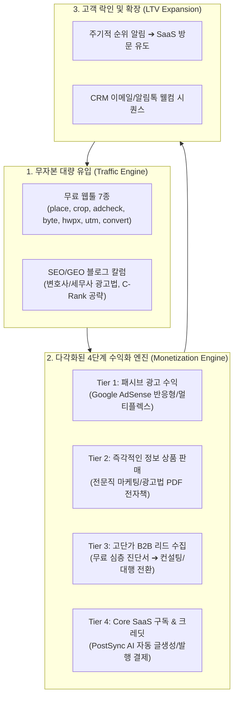

# 🚀 PostSync AI 플랫폼 수익화 마스터플랜 & 실행 기획서 (2026)

> **비전:** 단순 1인 블로그 툴을 넘어, **'전문직 및 1인 사업자를 위한 All-in-One AI 인바운드 마케팅 & 업무 생산성 플랫폼'**으로 도약하여 다각화된 월 반복 수익(MRR + Passive Cash Flow)을 창출한다.

---

## 1. 📊 최신 AI 마이크로 SaaS 수익화 벤치마킹 & 분석

2025~2026년 실리콘밸리와 글로벌 인디해커 진영에서 폭발적으로 검증된 **"Free Engineering as Marketing (무료 유틸리티 기반 성장)"** 모델을 PostSync의 현 상황과 비교 분석합니다.



### 💡 글로벌 성공 모델과의 심층 비교

| 수익 모델 유형 | 대표 사례 (글로벌/국내) | PostSync AI 적용 전략 | 기대 효과 & 마진율 |
| :--- | :--- | :--- | :--- |
| **A. Ad-Supported Utility**<br/>(광고 기반 무료 유틸리티) | IlovePDF, SmallSEOTools, 글자수세기 | `byte`(글자수), `crop`(이미지), `hwpx`(뷰어)에 상/하단 고단가 애드센스 탑재 | 순수 트래픽 가치화 (마진 100%, 서버비 상쇄) |
| **B. Lead Magnet to Agency**<br/>(진단 툴 기반 고단가 리드) | Neil Patel (Ubersuggest), HubSpot Website Grader | `place`(순위분석), `adcheck`(광고법) 무료 진단 후 "심층 리포트 신청" 유도 | 건당 100만~300만원 대행/자문 리드 창출 |
| **C. Digital Info-Products**<br/>(전자책 / 템플릿 즉시 결제) | Gumroad 전자책, 크몽 전문직 전자책 | 사이드바에 "2026 전문직 네이버 상위 1% 공략 PDF" (1.9만~4.9만원) 판매 | 즉각적인 초기 현금 흐름 창출 |
| **D. Product-Led SaaS**<br/>(핵심 솔루션 구독 전환) | Copy.ai, Jasper, v0.dev | 툴 사용 완료 화면에서 "이 작업, 매일 AI로 자동화하세요" ➔ 7일 무료체험 유도 | 지속 가능한 정기 구독 매출 (MRR) |

---

## 2. 🎯 7개 웹툴별 맞춤 수익화 매트릭스

모든 툴에 같은 방식을 적용하면 전환율이 떨어집니다. **툴의 성격(대중성 vs 전문성)**에 따라 수익 배치를 차별화합니다.

| 툴 이름 | 주요 타겟층 | 주력 수익 모델 (1순위) | 보조 수익 모델 (2순위) | 리드 마그넷 (다운로드 미끼) |
| :--- | :--- | :--- | :--- | :--- |
| **플레이스 순위 (`/place`)** | 자영업자, 병원장, 전문직 | 🎁 **고단가 리드 수집** (무료 심층 진단) | ⚡ **SaaS 구독** (일일 순위 자동추적) | "플레이스 3P 최적화 자가진단 체크리스트 PDF" |
| **광고법 스캐너 (`/adcheck`)** | 변호사, 세무사, 의료 마케터 | 📘 **전자책 즉시 판매** (광고법 준수 가이드) | 🎁 **컴플라이언스 대행 리드** | "2026 복지부/변협 필터링 금칙어 500제 모음집" |
| **상세 슬라이서 (`/crop`)** | 스마트스토어 셀러, 블로그 대행사 | ⚡ **SaaS 크레딧 전환** (배경 제거/AI 글쓰기) | 💰 **구글 애드센스 배너** | "구매전환율 300% 상세페이지 레이아웃 PSD" |
| **바이트 계산기 (`/byte`)** | 대중 블로거, 작가, 취준생 | 💰 **구글 애드센스** (대량 트래픽 노출) | 🔗 **제휴 마케팅** (키워드 분석 툴 등) | "네이버 C-Rank 알고리즘 로직 요약본" |
| **HWPX 웹 뷰어 (`/hwpx`)** | 공무원, 법조계, 공공기관 납품업체 | 💰 **구글 애드센스** + 📘 **업무 자동화 전자책** | ⚡ **기업용 대량 변환 라이선스** | "공공기관 입찰 제안서 작성 공식 서식" |
| **UTM 링크 빌더 (`/utm`)** | 전문 퍼포먼스 마케터, 그로스팀 | ⚡ **SaaS 구독** (자동 성과 대시보드) | 🔗 **B2B 마케팅 SaaS 제휴 링크** | "유입 채널별 ROAS 측정 엑셀 템플릿" |
| **포맷 변환기 (`/convert`)** | 범용 사무직, 학생, 프리랜서 | 💰 **구글 애드센스** (상/하단/전면) | 📘 **생산성 툴 전자책** | - |

---

## 3. 🏗️ 기술 아키텍처: "수익화 공통 레고 블록 (Monetization Layout)"

앞으로 어떤 툴이 추가되더라도 **단 1줄의 코드로 모든 수익화 장치가 자동 장착**되는 표준 레이아웃을 구축합니다.

### 📐 컴포넌트 계층 구조

```text
src/components/monetization/
├── ToolContainer.tsx          <-- [통합 레이아웃] 모든 툴의 좌/우 반응형 그리드 총괄
├── GoogleAdSlot.tsx           <-- [애드센스] 상단(가로), 하단(멀티플렉스), 사이드바(반응형)
├── LeadMagnetModal.tsx        <-- [리드 수집] 이메일/연락처 입력 시 PDF 즉시 전송 & DB 저장
├── EbookPromoCard.tsx         <-- [전자책 판매] 썸네일, 할인가, 즉시 결제 링크(토스/포트원)
├── SaasBridgeBanner.tsx       <-- [SaaS 전환] "PostSync AI로 원클릭 자동 포스팅하기" CTA
└── AffiliateLinkBox.tsx       <-- [제휴 마케팅] 추천 호스팅/장비/소프트웨어 링크 카드
```

### 🗄️ 단일 리드 수집 DB 스키마 (`leads` Table)

사용자가 툴에서 이메일이나 전화번호를 남겼을 때 한곳으로 모으는 통합 데이터베이스 구조입니다:

```prisma
model Lead {
  id          String   @id @default(cuid())
  toolSource  String   // 'place', 'adcheck', 'crop' 등 유입된 툴
  leadType    String   // 'ebook', 'audit_report', 'saas_trial' 등 신청 목적
  email       String?
  phone       String?
  businessName String? // 상호명 또는 병원/법률사무소 이름
  metadata    Json?    // 검색한 키워드, 광고법 위반 점수 등 부가 데이터
  status      String   @default("NEW") // NEW, CONTACTED, CONVERTED
  createdAt   DateTime @default(now())
}
```

---

## 4. 📅 단계별 실행 로드맵 (Action Priority Roadmap)

지치지 않고 즉각적인 성과를 보면서 나아갈 수 있도록 4단계로 분할 실행합니다.

### [Phase 1] 즉각적인 현금 흐름 & 유입 인프라 (1~2주 차)
* [ ] **애드센스 슬롯 표준화**: 웹툴 7종에 Google AdSense 광고 영역 일괄 배치 (데스크톱 728x90, 모바일 300x250)
* [ ] **통합 리드 수집 API 구축 (`/api/leads`)**:
  * 이메일/전화번호 입력 시 Supabase DB에 저장
  * 운영자 텔레그램으로 실시간 입수 알림 봇 발송 ("🔔 새로운 광고법 리포트 신청: 010-XXXX-XXXX")
* [ ] **전자책 1종 런칭 (MVP)**:
  * 예: *『2026 전문직 네이버 상위 1% 로직 & 법률/의료 광고 규정 실전 해설서』*
  * 토스페이먼츠 간편결제 연동 또는 크몽 링크 브릿지

### [Phase 2] 리드 마그넷 & 진단 자동화 (3~4주 차)
* [ ] **`place` 및 `adcheck` 툴에 "1초 PDF 진단 리포트" 발송 모달 장착**
  * 사용자가 URL이나 키워드를 넣고 검사 후, "상세 3페이지 분석 리포트를 이메일/카톡으로 무료 전송받기" 트리거
* [ ] **웰컴 자동 이메일 시퀀스 (Nurturing)**:
  * 리드 입력 시 Resend/Nodemailer로 진단서 PDF 즉시 자동 발송
  * 발송 이메일 하단에 "PostSync AI SaaS 7일 무료체험 쿠폰" 증정

### [Phase 3] SaaS 전환 최적화 (5~6주 차)
* [ ] **SaaS 브릿지 CTA 고도화**:
  * 웹툴 작업 완료 화면에 "직접 쓰지 마세요. AI가 법률/세무 칼럼을 알아서 완성합니다" 모달 노출
* [ ] **온보딩 체험 크레딧 제공**:
  * 가입 즉시 3편 무료 작성 크레딧 지급 ➔ 유료 구독(월 4.9만~19.9만원) 결제 유도

### [Phase 4] 서브도메인 & 롱테일 툴 무한 확장 (지속적 운영)
* [ ] **Next.js 서브도메인 리라이트 완성**: `place.postsyncapp.com`, `adcheck.postsyncapp.com`
* [ ] **신규 고수요 웹툴 3종 추가 기획**:
  * 네이버 블로그 누락/저품질 진단기
  * 메타(페이스북/인스타) 광고 카피 생성기
  * 유튜브 쇼츠 대본 분할기

---

## 5. 💬 사용자 결정 사항 (Next Action Decisions)

본 마스터플랜을 바탕으로 즉시 구현에 들어갈 최우선 순위 1가지를 선택해 주세요:

1. **옵션 A (최우선 추천 - 리드 수집 엔진 구축)**:  
   👉 DB `leads` 테이블 생성 + 공통 리드 API + 텔레그램 실시간 알림 연동 (어떤 툴에서든 고객 정보를 받는 심장)
2. **옵션 B (웹툴 광고/수익화 레이아웃 제작)**:  
   👉 웹툴 7종에 애드센스 슬롯 + 전자책 배너 + SaaS 전환 CTA를 입힐 `ToolLayout` 컴포넌트 개발
3. **옵션 C (전자책/리드마그넷 상품 기획 및 결제 연동)**:  
   👉 전문직/사업자 타겟 전자책 랜딩 및 원클릭 결제 페이지 구축
