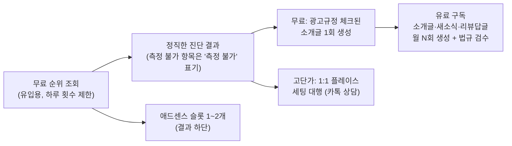

# 🔍 PlaceSync(플레이스 순위 조회) 감사 보고서 — A to Z

> **감사일:** 2026-10-08 · **대상:** `postsyncapp.com/place` 및 관련 API 7종  
> **방법:** 소스코드 전수 검토 + 운영(Production) API 실측 호출 + GitHub 공개 여부 확인  
> **원칙:** 칭찬 없음, 리스크 우선 (헌법 제9조)

---

## 0. 한 줄 결론 (Answer-First)

**지금 상태로 홍보 예산을 더 쓰면 손해입니다.**
유입이 늘수록 ① 공개 저장소에 노출된 비밀키, ② 가짜 기본값으로 만들어지는 "실측 진단서", ③ 백엔드가 없는 "월 9,900원 카톡 알림" 약속이 **같은 비율로 커집니다.**
홍보 전에 아래 P0 4건을 먼저 막아야 합니다.

| 등급 | 건수 | 성격 |
|---|---|---|
| 🔴 P0 (즉시) | 4 | 보안 사고 · 허위 데이터 · 법적 리스크 |
| 🟠 P1 (2주 내) | 7 | 기능 결함 · 신뢰도 · 수익 누수 |
| 🟡 P2 (1개월 내) | 6 | 성능 · SEO · UX 최적화 |

---

## 1. 🔴 P0 — 홍보 전에 반드시 막아야 할 4건

### P0-1. 텔레그램 봇 토큰이 공개 GitHub에 노출됨
- **위치:** `src/app/api/place-apply/route.ts:41`, `src/app/api/leads/route.ts:97`
- `process.env.TELEGRAM_BOT_TOKEN || '8314703344:AAGo...'` 형태로 **실제 토큰이 기본값으로 하드코딩**되어 있습니다.
- `git log -S`로 확인 결과 커밋 `0ac3f8a`부터 히스토리에 남아 있고, 저장소 `bbu99054-a11y/naver-saas`는 **비로그인 상태에서 열람됩니다(Public).**
- **피해 시나리오:** 누구나 이 봇으로 대표님께 가짜 "리드 접수" 메시지를 보내거나, `getUpdates`로 봇이 받은 메시지를 읽을 수 있습니다.
- 같은 파일 `src/app/api/leads/route.ts:127`에 **계좌번호와 실명**도 평문으로 공개되어 있습니다.
- **헌법 제2조 1항 직접 위반**입니다.

> [!CAUTION]
> **대표님이 직접 하셔야 하는 일 (코드 수정보다 먼저):**
> 텔레그램 `@BotFather` → `/revoke` 로 토큰 즉시 폐기 → 새 토큰을 Vercel 환경변수에만 등록.
> 코드에서 기본값만 지워도 **이미 공개된 히스토리의 토큰은 계속 유효**합니다. 폐기만이 해결책입니다.

### P0-2. 조회 데이터가 없으면 "2위"라고 적힌 가짜 진단서가 발급됨
- **위치:** `public/place.html:3566-3577`, `src/app/api/leads/route.ts:76-87`, `src/app/api/reports/place/route.ts:56-67`
- 순위 조회를 하지 않았거나 20위 밖이면 기본값이 들어갑니다:
  - `myRank: 2`, `mySaves: '10,000+'`, `myCoupon: true`, `top1Booking: true`
- **실제 40위인 사장님이 "2위" 진단서를 이메일로 받습니다.** 화면에는 "실측 진단서 발급 완료"라고 표시됩니다.
- 사장님이 실제 네이버와 비교하는 순간 PostSync 전체 신뢰도가 0이 됩니다. 상담 전환 이전에 이탈합니다.
- `src/app/api/place/rank/route.ts:164` `totalCount: Math.max(items.length, 20)` 역시 결과가 3개여도 "20개"로 부풀립니다.

### P0-3. 만들어지지 않은 유료 서비스를 약속하고 전화번호를 수집함
- **위치:** `public/place.html:2355-2367`
- "매일 아침 9시 카톡 순위 알림, **7일 무료 후 월 9,900원 정기 구독**"을 내걸고 있습니다.
- 코드 전체 검색 결과 `kakao_alert_opt_in`은 **프론트 HTML 2개 파일에만 존재**합니다. 크론(예약 실행), 알림톡 발송, 결제 연동이 **모두 없습니다.**
- 체크박스가 **기본 체크(checked)** 상태이고, 체크 시 휴대폰 번호가 **필수**가 됩니다.

| 법령 | 위반 소지 |
|---|---|
| 정보통신망법 제50조 | 광고성 정보 수신 동의를 **사전 체크**로 받는 것은 유효한 동의로 보기 어려움 |
| 개인정보보호법 제15·22조 | 수집 항목·목적·보유기간·거부권 **고지 문구가 폼에 없음** |
| 표시광고법 / 전자상거래법 | 제공 불가능한 서비스·가격을 표시 |

### P0-4. 모든 공개 API에 남용 방어가 없음
- `/api/place/rank`, `/api/leads`, `/api/place-apply`, `/api/place/kakao-webhook`, `/api/reports/place` — **요청 횟수 제한 0개, 봇 차단 0개.**
- **`/api/leads` = 남의 이메일로 메일 폭탄 발송기:** 아무 이메일이나 넣으면 Resend가 PostSync 도메인으로 리포트 메일을 보냅니다(`src/app/api/leads/route.ts:177-191`). 스팸 신고가 쌓이면 **도메인 평판이 떨어져 정상 고객 메일까지 스팸함으로 갑니다.**
- **카카오 웹훅 = 공짜 스크래핑 중계기:** 서명 검증이 없어 누구나 POST로 순위를 긁어갈 수 있습니다(`src/app/api/place/kakao-webhook/route.ts:99`).
- 결과적으로 **Vercel 서버 IP가 네이버에 차단**되면 툴 전체가 멈춥니다. 유입이 늘수록 차단 확률이 올라갑니다.
- 관리자 메일 HTML에 사용자 입력(`cleanName`, `metadata.message`)이 **이스케이프 없이** 들어갑니다 → 관리자 메일함 피싱 링크 주입 가능.

---

## 2. ⚙️ 기능·성능 감사 (운영 서버 실측)

### 2-1. 운영 API 실측 결과
`GET /api/place/rank?query=강남역 변호사&target=법무법인` 실제 호출:

| 항목 | 실측값 | 판정 |
|---|---|---|
| 응답 시간 | **3,853ms** | ❌ "1초 순위 조회" 표기와 불일치 |
| 순위 수집 | 20건 성공 | ✅ 동작 |
| 월간 검색량(`searchVolume`) | **`null`** | ❌ 검색량 카드가 운영에서 작동하지 않음 |
| 저장수(`saveCount`) | **20건 전부 `-`** | ❌ 수집 불가 |
| 블로그 리뷰 | **20건 전부 `0`** | ❌ 수집 불가 |
| 페이지 응답 | 503ms / 170KB | ⚠️ 무거움 |

### 2-2. "4대 격차 분석" 중 2개는 항상 틀린 결과
- 저장수가 `-`이면 `parseNum`이 0으로 바꿔 **1위와 격차 0 → "OPTIMAL(양호)"** 판정이 나옵니다(`src/app/api/place/rank/route.ts:400-426`).
- 사장님은 "저장수는 1위와 대등하다"는 **틀린 처방**을 받습니다. 2026 알고리즘에서 저장수는 핵심 행동 지표인데, 그 지표를 측정하지 못하면서 "양호"라고 표시하는 상황입니다.

### 2-3. 순위 정확도 결함
| 결함 | 내용 | 영향 |
|---|---|---|
| **고정 좌표** | 위치 미지정 시 항상 `x=127.1098, y=37.4965`(강남 일대) 사용 (`src/app/api/place/rank/route.ts:89-90`) | 부산·대구 사장님도 **강남 기준 순위**를 받음 |
| **순서 보장 없음** | Apollo 캐시를 `Object.entries` 순서로 순위 매김 | 캐시 저장 순서 ≠ 화면 노출 순서일 수 있음 |
| **광고 혼입** | 2·3차 폴백은 "광고" 글자만 지우고 업체는 남김 | "자연 순위 100% (광고 제외)" 배지가 허위가 될 수 있음 |
| **이름 오매칭** | `includes()` 양방향 비교 | 실측 시 `target=법무법인` → **1위 "법무법인 YK"를 내 매장으로 오인** |
| **20위 상한** | 최대 20개만 수집 | 진짜 고객층(20~100위 소상공인)은 전부 "20위권 밖" → 툴의 쓸모가 사라짐 |

### 2-4. "AI 진단"의 실체
- `src/lib/ai/jevClient.ts:317-349` `diagnosePlaceWithJev`는 **AI 호출이 없는 if/else 규칙**입니다. 순위 구간별로 점수 38/48/62/74/86/96을 고정 부여합니다.
- 문구 속 수치("+20점 가산점", "CTR 35% 상승", "모바일 유입 85% 유실")는 **근거 데이터가 없습니다.** 네이버는 이런 가중치를 공개한 적이 없습니다.
- "AI 0.05초 진단" 표기는 실제 구현과 맞지 않습니다.

### 2-5. 소개글 생성 API
- `src/app/api/place/intro/route.ts:34` `gemini-1.5-flash` = **2026년 기준 이미 종료된 모델**입니다. AI 호출이 실패하고 매번 템플릿으로 넘어갈 가능성이 높습니다.
- 템플릿이 고객 사무소에 대해 **확인하지 않은 사실**을 적습니다: "전용 무료 주차 완비", "역 도보 3분", "비밀을 100% 보장".
- 변호사 전용 문구만 있어 세무사·병원 사장님이 쓰면 변호사 소개글이 나옵니다.

---

## 3. 🛡️ 보안 감사 종합

| # | 항목 | 상태 | 등급 |
|---|---|---|---|
| 1 | 비밀키 하드코딩 (텔레그램 2곳) | 공개 노출 | 🔴 |
| 2 | 계좌번호·실명 공개 저장소 노출 | 노출 | 🔴 |
| 3 | API 요청 횟수 제한 | 없음 | 🔴 |
| 4 | 카카오 웹훅 서명 검증 | 없음 | 🔴 |
| 5 | 리드 개인정보 암호화 (헌법 제6조 요구사항) | **평문 저장** (`email`, `phone`, `metadata.clientPhone`) | 🟠 |
| 6 | 관리자 메일 HTML 이스케이프 | 없음 | 🟠 |
| 7 | 리포트 조회 API | 인증 없음 · 조회할 때마다 네이버 실시간 수집 · 최근 200건 전체 스캔 폴백 | 🟠 |
| 8 | 리포트 ID | `Math.random` 6자리 (예측 가능한 난수) | 🟡 |
| 9 | 보안 헤더 | HSTS만 존재, **CSP·X-Frame-Options 없음** | 🟡 |
| 10 | 리포트 페이지 `noindex` | 없음 → 고객 상호명이 검색엔진에 색인될 수 있음 | 🟡 |
| 11 | 순위표 렌더링 XSS | `escapeHtml` 적용 확인 | ✅ 문제 없음 |

---

## 4. 👁️ UI/UX 감사

### 4-1. 신뢰를 깎는 문구 (가장 시급)
| 화면 문구 | 문제 |
|---|---|
| "네이버 스마트플레이스 **공식** 실측 순위 동기화 센터" | 네이버와 무관한데 **제휴로 오인**하게 만듦 → 상표·표시광고 리스크 |
| 로딩 "네이버 지도 **API 통신** 중" | 공식 API가 아니라 HTML 수집 방식 |
| FAQ "네이버 공식 데이터… **가공 없이 100% 정직**" | 고정 좌표 + 20위 상한이라 사실과 다름 |
| 가이드 "**네이버 공식 개정 기준**" + 반영 비중표 30/20/25/15/10% | 네이버가 공개한 적 없는 수치. **AI 검색(GEO)은 출처 없는 수치를 인용하지 않음** |
| "1초 순위 조회" | 실측 3.8초 |

### 4-2. 전환(신청) 흐름의 마찰
- 신청 폼에 **CTA 3개가 경쟁**합니다: 무료 리포트 / 카톡 매일 알림(유료) / 카카오 채널 추가. 사장님이 무엇을 받는지 헷갈립니다.
- 전화번호가 기본 필수입니다. 무료 리포트만 원하는 사람에게는 이탈 요인입니다.
- 결과를 보기 **전에** 신청 폼이 먼저 보이는 위치(순위표 바로 아래)라서, 20위 밖 사용자에게는 "결과는 없는데 폰번호부터 달라"는 경험이 됩니다.

### 4-3. 구조·유지보수
- `place.html`과 `place/index.html`이 **해시값까지 동일한 복사본**입니다. 한쪽만 고치면 두 페이지가 어긋납니다.
- 3,835줄 단일 파일, 이 중 **CSS 약 1,870줄(140-2008줄)이 `<head>`에 직접 삽입**되어 있습니다.
- JSON-LD 블록이 **2개(32줄, 2011줄)** 로 중복되고, Breadcrumb·WebApplication·SoftwareApplication이 겹칩니다.
- 헌법 제5조 폰트 규정(Plus Jakarta Sans / Noto Sans KR)과 달리 Pretendard를 사용 중입니다.

---

## 5. 💰 수익 모델 감사

### 5-1. 현재 수익 엔진 실제 작동 여부
| 마스터플랜 단계 | 화면 표기 | 실제 상태 | 월 기대수익 |
|---|---|---|---|
| ① 애드센스 | 스크립트 로드됨 | **광고 슬롯(`<ins>`) 0개** → 노출 0 | **0원** (스크립트 비용만 부담) |
| ② 전자책 39,000원 | 카드 존재 | **`display:none !important`로 숨김** | **0원** |
| ③ 리드마그넷(리포트) | 작동 | 가짜 기본값 문제(P0-2) | 간접 |
| ④ SaaS 구독 9,900원 | 문구 존재 | **백엔드·결제 없음** | **0원** |
| ⑤ 카카오 1:1 상담 → 대행 | 링크 작동 | 유일하게 작동하는 경로 | 상담 전환율에 전적으로 의존 |

**결론:** 마스터플랜 4단계 중 **실제로 돈이 될 수 있는 경로는 "카톡 상담" 하나뿐**입니다. 그 경로의 입구(진단서)가 P0-2로 오염되어 있습니다.

### 5-2. 거시 관점 — 순위 조회 자체는 돈이 안 되는 시장
- 순위 조회는 **이미 무료가 표준**입니다(애드로그, N체커 등). 애드로그는 N1·N2·N3 지수까지 제공합니다. "무료 순위 조회"만으로는 차별점이 없습니다.
- 순위 수집은 **네이버 이용약관상 자동 수집 금지 영역**입니다. 이 위에 유료 구독(매일 자동 조회)을 얹으면 ① 법적 리스크, ② IP 차단에 따른 서비스 중단 리스크가 **매출과 비례해** 커집니다.
- **PostSync가 이길 수 있는 지점은 수집이 아니라 "처방 실행"입니다.**
  - 전문직(변호사·세무사·병원) **광고규정 준수 소개글·새소식·리뷰 답글 생성** → 경쟁 툴이 못 하는 영역, 네이버 수집에 의존하지 않음, 헌법 제4조 자산을 그대로 활용.

### 5-3. 권장 수익 구조 (재설계안)

- **9,900원 매일 알림은 내리거나 "출시 알림 신청(대기자 명단)"으로 바꾸는 것**이 법적으로 안전하고, 실제 수요도 측정할 수 있습니다.

---

## 6. 🚀 유입 및 1페이지 노출 전략

### 6-1. 전제: 고객이 어디서 검색하는가
- 타깃(소상공인·전문직 사장님)의 검색은 **네이버 비중이 압도적**입니다. 네이버 통합검색은 블로그·카페·지식iN을 우선 노출하므로, **웹사이트 단독으로 "플레이스 순위 조회" 1페이지 진입은 어렵습니다.**
- 따라서 전략은 **"네이버 생태계 안에 입구를 여러 개 만들고 → 툴로 모은다"** 입니다.

### 6-2. 채널별 실행안
| 채널 | 실행 | 우선순위 |
|---|---|---|
| **네이버 서치어드바이저** | `/place`·블로그 칼럼 16편 사이트맵 제출, 웹페이지 수집 요청 | 즉시 |
| **자사 네이버 블로그** | 툴 결과 캡처를 쓴 실사례형 글 주 2회 ("○○동 세무사 플레이스 20위→7위 기록") → 툴 링크 | 높음 |
| **카카오 챗봇** | 이미 구축됨. 서명 검증 후 카카오 채널 친구 모으기의 입구로 활용 | 높음 |
| **지식iN 답변** | "플레이스 순위 확인 방법" 질문에 방법 설명 + 툴 링크 (홍보성 반복은 제재 대상이므로 정보 위주) | 중간 |
| **구글 (GEO)** | 출처 없는 수치 삭제 → 네이버 공식 고객센터·공식 블로그 **인용 링크** 첨부 → AI 개요(AI Overviews) 인용 가능성 확보 | 중간 |
| **결과 공유 바이럴** | 공유 링크 기능 존재. 결과별 OG 이미지(순위 카드)를 자동 생성하면 카톡 공유 클릭률 상승 | 중간 |

### 6-3. 하지 말아야 할 것
- **지역×업종 자동 생성 페이지 대량 발행:** 구글의 "대량 생성 콘텐츠 남용(scaled content abuse)" 정책 대상입니다. 실데이터 없는 수백 페이지는 사이트 전체 평가를 깎습니다.
- **출처 없는 통계 반복** ("90%가 1페이지에서 결정", "매출 80%"): 네이버 C-Rank·구글 E-E-A-T 모두 신뢰 감점 요인입니다.

### 6-4. 기술 SEO 개선
- 인라인 CSS 1,870줄 → 외부 CSS 분리 (캐시 재사용, 첫 화면 표시 속도 개선)
- Font Awesome 전체(CDN) → 실제 쓰는 아이콘만 SVG로 교체
- JSON-LD 2블록 → 1블록으로 통합, 중복 타입 제거
- `place/index.html` 복사본 정리 (단일 원천 원칙)

---

## 7. 📋 실행 로드맵

| 단계 | 기간 | 작업 | 담당 |
|---|---|---|---|
| **P0** | **오늘** | 텔레그램 토큰 폐기·재발급 | 🧑‍💼 대표님 |
| P0 | 1~2일 | 하드코딩 키·계좌 제거 / 가짜 기본값 제거("측정 불가" 표기) / 9,900원 문구 → 대기자 명단 전환 / 개인정보 동의 체크박스(기본 해제) + 고지문 | 🤖 에이전트 |
| P0 | 1~2일 | API 요청 횟수 제한(IP 기준), 이메일 발송 전 중복·빈도 제한, 카카오 웹훅 검증 | 🤖 에이전트 |
| P1 | 1~2주 | 허위·과장 문구 정리("공식", "API", "100%", "1초", 근거 없는 수치) / 저장수·블로그 측정 불가 처리 / 이름 매칭 정밀화 / 소개글 모델 교체 + 업종별 분기 / 검색량 API 환경변수 점검 | 🤖 에이전트 |
| P1 | 1~2주 | 애드센스 슬롯 1~2개 배치 / 리드 개인정보 암호화 / 리포트 `noindex` | 🤖 에이전트 |
| P2 | 1개월 | CSS 분리·아이콘 경량화·JSON-LD 통합·복사본 정리 / 결과 OG 이미지 / 네이버 블로그·서치어드바이저 운영 | 🤖 + 🧑‍💼 |

---

## 8. ⚠️ 감사 한계
- 네이버 플레이스 순위 알고리즘은 비공개입니다. 본 보고서의 정책 동향은 공개된 업계 자료 기준이며, 네이버 공식 가중치는 확인할 수 없습니다.
- 라이브 실측은 1회 호출(강남역 변호사) 기준입니다. 다른 키워드·시간대에서는 응답 시간과 수집 항목이 달라질 수 있습니다.
- 애드센스·전환율 등 실제 매출 데이터(GA4, 애드센스 콘솔)는 접근 권한이 없어 확인하지 못했습니다.
